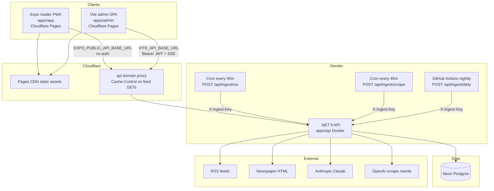
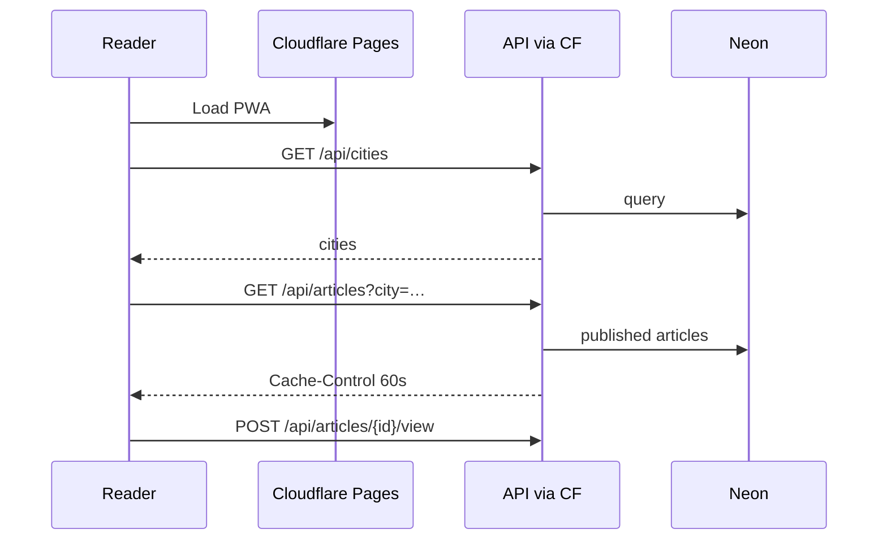
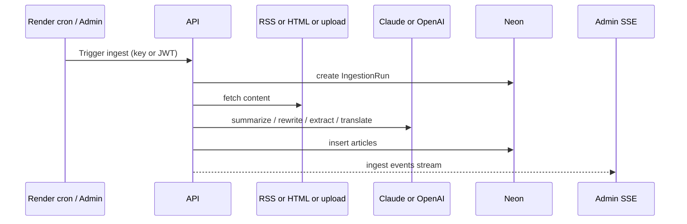

# System overview

> **Living doc** — update in the same change when topology, hosting, or cross-app contracts move.  
> **Last verified against:** 2026-08-27 (actual Cloudflare Pages project names)

## Purpose

End-to-end picture of TazaKhabar: who talks to whom, where code lives, and why the stack looks like this.

## Boundaries

- **In scope:** Reader ↔ API ↔ Neon; admin ↔ API; Cloudflare Pages + proxied API; Render API + ingest crons; outbound RSS/HTML/Claude/OpenAI.
- **Out of scope:** Marketing site, native EAS store details, future multi-editor identity.

## Context diagram

## Components / key types

| Component | Path / host | Role |
|-----------|-------------|------|
| Reader | `apps/app` → Cloudflare Pages `newsfeed-web` | City feed, search, share, PWA |
| Admin | `apps/admin` → Cloudflare Pages `newsfeed-admin` | Review queue, sources, uploads, live ingest |
| API | `apps/api` → Render `tazakhabar-api` | Sole DB client; public + admin + ingest |
| Shared types | `packages/shared-types` | OpenAPI → NSwag DTOs |
| DB | Neon Postgres | Production data; local Docker Postgres |
| Migrations | `infra/migrations` | EF Core; applied on API startup |

## Data & control flows

### Reader happy path

### Ingest + editorial path

## Tech stack and why

| Choice | Why |
|--------|-----|
| **Monorepo + pnpm** | Two-person team; API + types + clients stay one PR ([ADR-001](../adr/001-monorepo.md)) |
| **.NET 8 Minimal API + EF + Postgres** | Single data owner; OpenAPI contract surface (PRD + architecture rules) |
| **No reader auth** | Validate city → feed → WhatsApp via QR without accounts ([ADR-002](../adr/002-no-auth-mvp.md)); abuse via rate limit + CORS |
| **Expo universal client** | One UI for PWA now + native later; no separate Vite reader ([ADR-003](../adr/003-expo-universal-client.md)) |
| **Admin Vite SPA** | Dense editorial UI must not ship inside public PWA ([ADR-006](../adr/006-internal-admin-spa.md)) |
| **Shared admin password + JWT** | Editorial writes without a user table ([ADR-005](../adr/005-admin-shared-credential.md)) |
| **Render + Cloudflare Pages + Neon** | Docker API auto-deploy; static CDNs; edge-cache feed GETs to cut Neon cost ([ADR-004](../adr/004-render-cloudflare-neon-hosting.md)) |
| **Claude (`ArticleIntelligence`)** | Summarize, PDF/image story extract, translate |
| **OpenAI (`OpenAiRewrite`)** | Rewrite scraped articles into original digest summary + body |
| **Light + dark UI, single blue accent** | Dual palettes; brand fill `#155EEF`; Appearance preference on Profile |

## Key files

- `apps/api/Program.cs`
- `render.yaml`
- `.github/workflows/ci.yml`, `.github/workflows/deploy.yml`
- `docs/adr/001-monorepo.md` … `006-internal-admin-spa.md`
- `docs/PRD.md`

## Public contracts

| Surface | Contract |
|---------|----------|
| Public API | `/api/*` (no auth); rate limit `public` |
| Admin API | `/api/admin/*` Bearer JWT (login excepted) |
| Ingest | `POST /api/ingest/rss\|scrape\|daily` + `X-Ingest-Key` |
| Reader env | `EXPO_PUBLIC_API_BASE_URL` |
| Admin env | `VITE_API_BASE_URL` |
| OpenAPI | `GET /openapi/v1.json` |

## Failure modes & invariants

- **API is the only process that talks to Postgres** — frontends never use Neon connection strings.
- CORS allowlist only — never `AllowAnyOrigin` in staging/production.
- Feed GETs may be ~60s stale at the Cloudflare edge.
- Render health check is `/healthz` (not `/api/health`).
- Product placeholder name is **TazaKhabar** until rename.

## Related docs

- Hub: [README](./README.md)
- [ADR-001](../adr/001-monorepo.md) … [ADR-006](../adr/006-internal-admin-spa.md)
- [PRD](../PRD.md)
- Hosting design: `docs/superpowers/specs/2026-08-03-render-cloudflare-hosting-design.md`

## Change checklist

| When you change… | Update… |
|------------------|---------|
| Who talks to whom / hosting topology | This page + [08-hosting-and-ci](./08-hosting-and-ci.md) |
| New app or package | This page + [01-monorepo](./01-monorepo.md) + hub README |
| Stack rationale / ADR | Link ADR here; do not rewrite ADR text for “now” |
