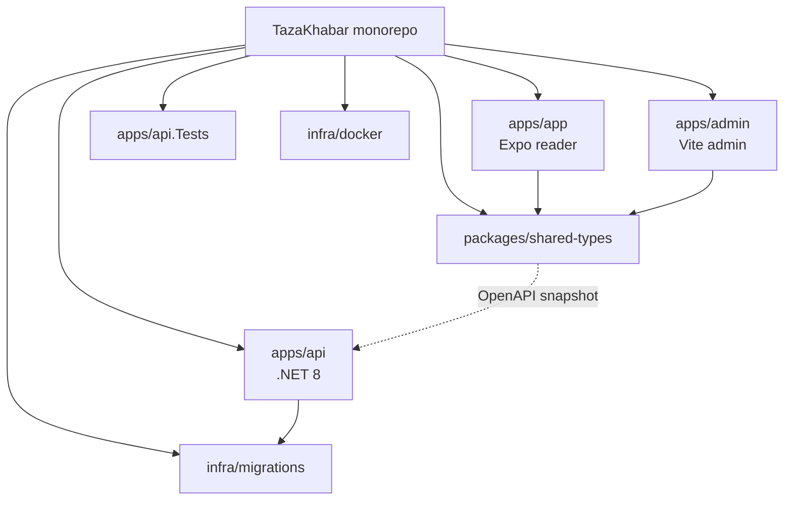

# Monorepo

> **Living doc** — update when workspace packages, root scripts, or layout change.  
> **Last verified against:** 2026-08-27 (local working tree)

## Purpose

Describe package layout, tooling, and boundaries so API / types / clients stay coordinated in one repo.

## Boundaries

- **In scope:** `apps/*`, `packages/*`, `infra/*`, root scripts, solution file, pnpm workspace.
- **Out of scope:** Per-feature folder trees inside an app (see subsystem pages).

## Context diagram

## Components / key types

| Path | Package / project | Role |
|------|-------------------|------|
| `apps/app` | `@tazakhabar/app` | Expo universal reader |
| `apps/admin` | `@tazakhabar/admin` | Editorial Vite SPA |
| `apps/api` | `TazaKhabar.Api` | Minimal API |
| `apps/api.Tests` | `TazaKhabar.Api.Tests` | xUnit + WebApplicationFactory |
| `packages/shared-types` | `@tazakhabar/shared-types` | Generated TS DTOs |
| `infra/docker` | — | `Dockerfile.api`, optional `Dockerfile.web` |
| `infra/migrations` | `TazaKhabar.Api.Migrations` (legacy namespace) | EF migrations compiled into API |
| `TazaKhabar.sln` | — | API + tests |
| `pnpm-workspace.yaml` | — | `apps/app`, `apps/admin`, `packages/*` |

## Data & control flows

Root scripts (see root `package.json`):

| Script | Does |
|--------|------|
| `pnpm dev:web` | Expo web reader |
| `pnpm build:web` | `expo export -p web` → `apps/app/dist` |
| `pnpm dev:admin` | Vite admin |
| `pnpm generate:types` | NSwag generate from OpenAPI snapshot |
| `pnpm dev:api` / `dotnet run` | API |
| `pnpm test:api` / `dotnet test` | Backend tests |

Local stack: Docker Postgres ↔ API ↔ Metro/Expo + Vite admin.

## Key files

- `package.json`, `pnpm-workspace.yaml`
- `TazaKhabar.sln`
- `docker-compose.yml`
- `apps/README.md`
- `.cursor/rules/architecture.mdc`

## Public contracts

Workspace consumers depend on `@tazakhabar/shared-types`. Contract changes require **same PR**: API OpenAPI + snapshot + generated types + app/admin consumers.

## Failure modes & invariants

- No Turborepo/Nx until CI build time hurts ([ADR-001](../adr/001-monorepo.md)).
- Do not add a separate Vite/CRA **reader** — only admin is the Vite exception ([ADR-003](../adr/003-expo-universal-client.md), [ADR-006](../adr/006-internal-admin-spa.md)).
- Never edit applied EF migrations; add new ones under `infra/migrations`.

## Related docs

- [00-system-overview](./00-system-overview.md)
- [ADR-001](../adr/001-monorepo.md)

## Change checklist

| When you change… | Update… |
|------------------|---------|
| Add/remove app or package | This page + hub + [00-system-overview](./00-system-overview.md) + `architecture.mdc` |
| Root scripts / workspace globs | This page |
