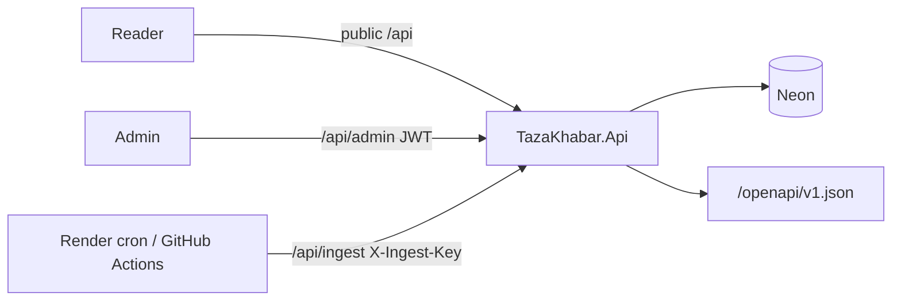

# API

> **Living doc** — update when endpoints, auth, rate limits, CORS, or DI composition change.  
> **Last verified against:** 2026-08-29 (scheduled RSS endpoints publish fast baseline feed)

## Purpose

`.NET 8` Minimal API (`TazaKhabar.Api`) is the only process that talks to Postgres and the contract surface for reader, admin, and ingest.

## Boundaries

- **In scope:** `Program.cs`, `Endpoints/*`, options, DI, OpenAPI, middleware (CORS, auth, rate limit, forwarded headers).
- **Out of scope:** Ingest algorithm details ([04-ingestion](./04-ingestion.md)); hosting ([08-hosting-and-ci](./08-hosting-and-ci.md)).

## Context diagram

## Components / key types

| Area | Location |
|------|----------|
| Entry | `apps/api/Program.cs` |
| Endpoints | `apps/api/Endpoints/` |
| Options | `apps/api/Options/` (`Cors`, `RateLimiting`, `RssIngest`, `Admin`, `ArticleIntelligence`, `OpenAiRewrite`, `Upload`) |
| Presentation | `Services/ArticlePresentationService.cs`, `Services/CityCalendar.cs` |
| Logging | Serilog console + request/ingestion correlation properties |

Pipeline (order): Serilog request logging → RequestId header/log context → ExceptionHandler → StatusCodePages → ForwardedHeaders → CORS → AuthN → AuthZ → RateLimiter.

## Data & control flows

### Public endpoints (rate limit policy `public`)

| Method | Path | OpenAPI name | Notes |
|--------|------|--------------|-------|
| GET | `/api/health` | `GetHealth` | App health |
| GET | `/healthz` | — | ASP.NET + Npgsql; Render health check |
| GET | `/api/cities` | `GetCities` | Alphabetical city catalog with latitude/longitude; `Cache-Control: public, max-age=60` |
| GET | `/api/articles` | `GetArticles` | `city` required; published only; hides newspaper e-paper editions; cache 60s; **no `body`** |
| GET | `/api/articles/dates` | `GetArticleDates` | City calendar (Asia/Kolkata) |
| GET | `/api/articles/trending` | `GetTrendingArticles` | View-based; **no `body`** |
| POST | `/api/articles/{id}/view` | `RecordArticleView` | Optional `sessionId` |
| GET | `/api/articles/{id}` | `GetArticleById` | Published only; includes plain-text `body` when stored |
| POST | `/api/ingest/rss` | `IngestRss` | `X-Ingest-Key`; scheduled no-AI baseline, auto-publishes feed snippets |
| POST | `/api/ingest/scrape` | `IngestScrape` | `X-Ingest-Key` |
| POST | `/api/ingest/daily` | `IngestDaily` | `X-Ingest-Key`; nightly RSS + scrape batch, RSS auto-publishes feed snippets, no Claude summarization and no OpenAI rewrite |
| POST | `/api/ingest/backfill-bodies` | `IngestBackfillBodies` | `X-Ingest-Key`; fills missing `body` from source HTML |

### Admin endpoints

| Method | Path | Auth |
|--------|------|------|
| POST | `/api/admin/login` | Anonymous; rate limit `admin-login` (5/IP/min) |
| GET/POST | `/api/admin/articles` | JWT |
| PATCH | `/api/admin/articles/{id}` | JWT |
| POST | `/api/admin/articles/{id}/publish\|reject\|archive` | JWT |
| GET/POST/PATCH | `/api/admin/sources` | JWT |
| POST | `/api/admin/sources/{id}/trigger` | JWT → 202 + background run |
| GET | `/api/admin/ingestion-runs` | JWT |
| GET | `/api/admin/ingestion-runs/{id}/events` | JWT **SSE** |
| POST/GET | `/api/admin/uploads` | JWT multipart |
| GET | `/api/admin/uploads/{id}` | JWT |

### Auth model

- Readers: none ([ADR-002](../adr/002-no-auth-mvp.md)).
- Admin: shared password + display name → HS256 JWT 8h ([ADR-005](../adr/005-admin-shared-credential.md)).
- Production startup fails if admin password/JWT signing key are missing, default, or too short.
- Ingest key is **not** accepted on admin routes.
- CORS: configured `Cors__AllowedOrigins__*` plus HTTPS hosts under the actual `*.newsfeed-web.pages.dev` / `*.newsfeed-admin.pages.dev` projects and future-branded `*.tazakhabar-web.pages.dev` / `*.tazakhabar-admin.pages.dev` aliases. Never `AllowAnyOrigin`.

## Key files

- `apps/api/Program.cs`
- `apps/api/Endpoints/*`
- `apps/api/TazaKhabar.Api.csproj`

## Public contracts

| Env / config | Purpose |
|--------------|---------|
| `ConnectionStrings__Database` | Neon / local Postgres |
| `Cors__AllowedOrigins__*` | Reader + admin Pages origins |
| `RateLimiting__PermitLimit` / `WindowSeconds` | Public IP fixed window |
| `RssIngest__Secret` | Ingest header for Render crons and GitHub Actions nightly trigger |
| `Admin__Password` / `Admin__JwtSigningKey` | Admin login |
| `ArticleIntelligence__*` | Claude |
| `OpenAiRewrite__*` | OpenAI scrape rewrite (`Enabled` + key); `Enabled=false` or empty key stores extract as-is |
| `Upload__RootPath` | PDF/image storage |

OpenAPI: `MapSwagger("/openapi/{documentName}.json")` → `/openapi/v1.json`. Swagger UI in Development only.

`CityResponse` exposes the stable city id/name/state/slug plus public city-centre
latitude and longitude. The reader uses those coordinates locally to choose the
nearest supported city; it never sends device coordinates to the API.

## Failure modes & invariants

- Empty CORS origins → startup failure (allowlist required).
- Rate limit all public endpoints until reader auth exists.
- No secrets in logs; ProblemDetails for errors.
- Admin write payloads validate required fields before endpoint logic touches them; malformed JSON returns 400 rather than falling into 500s.
- Responses include `X-Request-ID`, and logs include `RequestId`; ingest logs include `IngestionRunId` where a run exists.
- Production startup does not apply EF migrations; use the explicit migration workflow.
- New endpoints must appear in OpenAPI and regenerate shared-types in the same PR.

## Related docs

- [03-data-model](./03-data-model.md), [04-ingestion](./04-ingestion.md), [07-shared-types](./07-shared-types.md)
- Security: `.cursor/rules/security.mdc`

## Change checklist

| When you change… | Update… |
|------------------|---------|
| Endpoints / auth / rate limit / CORS | This page + OpenAPI consumers |
| Topology of who calls API | [00-system-overview](./00-system-overview.md) |
| DI for ingest workers | This page + [04-ingestion](./04-ingestion.md) |
