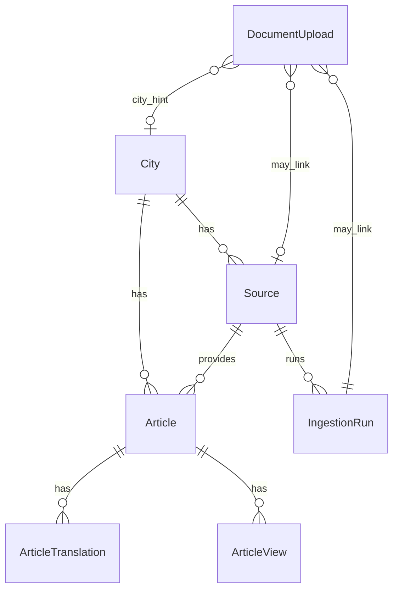
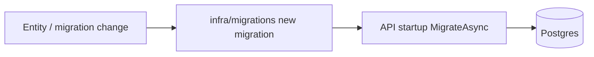

# Data model

> **Living doc** — update when entities, statuses, or migration ownership change.  
> **Last verified against:** 2026-08-14 (local working tree)

## Purpose

Postgres schema owned by the API: entities, enums/statuses, and how migrations are applied.

## Boundaries

- **In scope:** EF entities, enums, `AppDbContext`, `infra/migrations`, seed data that ships in migrations.
- **Out of scope:** Client-only storage (AsyncStorage city preference, sessionStorage JWT).

## Context diagram



## Components / key types

**DbContext:** `apps/api/Data/AppDbContext.cs`

| Entity | Table | Notes |
|--------|-------|-------|
| `City` | `cities` | `Name`, `State`, unique `Slug` |
| `Source` | `sources` | `FeedUrl`, `Type`, `Kind`, `Language`, `IsActive`, fetch status, `ScrapeConfig` |
| `Article` | `articles` | Headline/summary/source fields, `Status`, `IsMock`, review fields, `DetectedLanguage`, `ImageUrl`, unique `SourceUrl` |
| `IngestionRun` | `ingestion_runs` | Counts found/added/skipped/failed, `ErrorSummary` |
| `DocumentUpload` | `document_uploads` | Path, `Status`, links to run/source/city hint |
| `ArticleTranslation` | `article_translations` | Target lang + translated headline/summary |
| `ArticleView` | `article_views` | Anonymous `SessionKey` for trending |

### Enums (`apps/api/Data/`)

| Enum | Values |
|------|--------|
| `ArticleStatus` | `Published`, `Draft`, `PendingReview`, `Rejected`, `Archived` |
| `SourceType` | `Rss`, `Manual`, `PdfUpload`, `Scrape` |
| `SourceKind` | `CityEdition`, `Wider` |
| `FetchStatus` | `Success`, `Error` |
| `DocumentUploadStatus` | `Queued`, `Processing`, `Ready`, `Failed` |
| `TranslationStatus` | `Completed`, `Failed` |

## Data & control flows



Generate:

```bash
dotnet ef migrations add <Name> \
  --project apps/api/NewsFeed.Api.csproj \
  --output-dir ../../infra/migrations \
  --namespace NewsFeed.Api.Migrations
```

Migrations are compiled into the API via csproj include of `infra/migrations/**/*.cs`.

## Key files

- `apps/api/Data/AppDbContext.cs`
- `apps/api/Data/Entities/*`
- `infra/migrations/*`

## Public contracts

Public feed only exposes **Published** articles (see [02-api](./02-api.md)). Status transitions are admin/ingest concerns.

## Failure modes & invariants

- Never edit applied migrations; add a new one.
- Unique `SourceUrl` prevents duplicate ingest inserts.
- API is the only DB client — no Neon creds in frontends.
- Startup migration failure prevents healthy boot (Render `/healthz` fails).

## Related docs

- [02-api](./02-api.md), [04-ingestion](./04-ingestion.md)
- Specs under `docs/superpowers/specs/*ingest*`, `*editorial*`

## Change checklist

| When you change… | Update… |
|------------------|---------|
| Entity / enum / status | This page + consumers (API/admin/reader) as needed |
| New migration | This page (notable migrations list if behavior-changing) |
| Who owns schema | [00-system-overview](./00-system-overview.md) |
