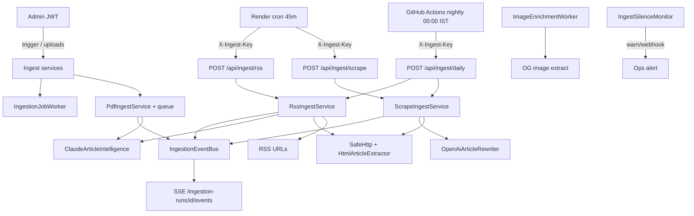
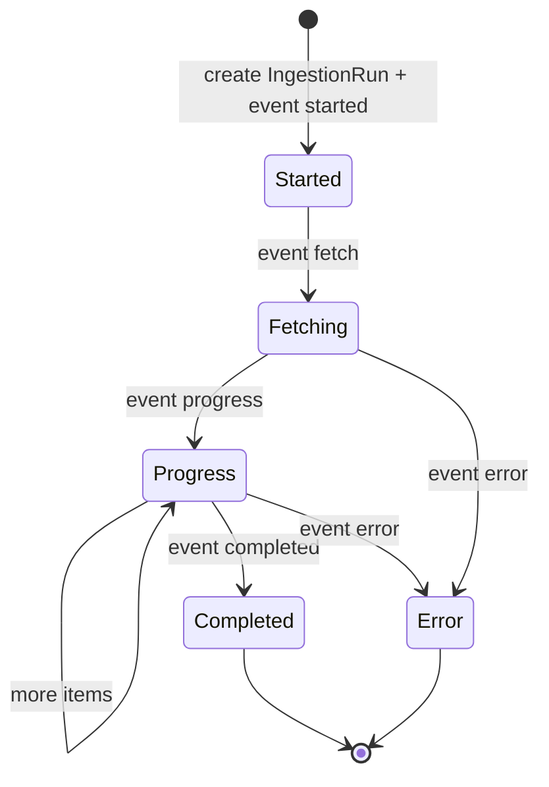

# Ingestion

> **Living doc** — update when pipelines, article status on insert, cron, SSE, or intelligence providers change.  
> **Last verified against:** 2026-09-01 (in-process ingest scheduler, deepened publisher catalog, batched RSS cron)

## Purpose

Bring external news into Postgres: RSS, HTML scrape, PDF/image upload, optional Claude intelligence, OpenAI scrape rewrite, background image enrichment, and live run events for admin.

## Daily source strategy

The daily feed is filled from a layered source mix rather than a single publisher:

1. **Primary:** official RSS feeds from local or city editions when available.
2. **Secondary:** official city pages scraped into plain text when RSS is absent or too thin.
3. **Discovery backfill:** Google News RSS city queries (`when:7d`) to catch late-breaking items and widen coverage.
4. **Editorial safety net:** the admin review queue and manual uploads remain available when a city is sparse or a source goes dark.

The seeded catalog covers 75 major Indian cities. Agra, Jhansi, Kanpur, Lucknow,
and Delhi retain the deeper pilot source mix; each of the other 70 cities starts
with an active Google News RSS city query so scheduled ingestion can populate a
baseline feed while direct publisher sources are added. A second migration deepens
coverage with Amar Ujala city RSS, Dainik Bhaskar local scrape, Times of India
city scrape (metros), and English Google News discovery feeds. The overall mix includes:

- local publisher RSS where it exists,
- TOI city pages for scrape fallback,
- Google News RSS search feeds for discovery,
- and the existing no-AI nightly batch to keep ingestion cheap and repeatable.

Public output still stays conservative: headline, short summary, source attribution, and a link back to the original article. Raw HTML is never stored.

## Boundaries

- **In scope:** `apps/api/Ingest/*`, ingest HTTP triggers, Render crons, event bus + SSE, queues/workers.
- **Out of scope:** Admin UI chrome ([05-admin](./05-admin.md)); hosting blueprint details beyond cron ([08-hosting-and-ci](./08-hosting-and-ci.md)).

## Context diagram

## Components / key types

| Pipeline | Service | Trigger | Insert status (current) |
|----------|---------|---------|-------------------------|
| RSS | `RssIngestService.cs` | Cron or admin source trigger | Scheduled no-AI endpoints: `Published`; default/manual service path: `PendingReview` |
| Scrape | `ScrapeIngestService.cs` + `HtmlArticleExtractor`, `ScrapeHttpClient`, `OpenAiArticleRewriter` | Cron or admin trigger | `Published` |
| PDF / image | `PdfIngestService.cs`, `PdfTextExtractor` (PdfPig), `PdfProcessingQueue` + `PdfProcessingWorker` | Admin uploads | `PendingReview` |
| Image OG | `ArticleImageEnrichmentService`, `OgImageExtractor`, `ImageEnrichmentQueue` + worker | After ingest | Updates `ImageUrl` |

| Piece | Path / type |
|-------|-------------|
| Intelligence | `IArticleIntelligence` → `ClaudeArticleIntelligence` |
| Scrape rewrite | `IArticleRewriter` → `OpenAiArticleRewriter` |
| Safety | `SafeHttp.cs` (blocks private/localhost targets; scrape re-validates each redirect `Location`) |
| Events | `IngestionEventBus`, `IngestionEvents.Emit`, `IngestionEventDto` |
| Run row | `IngestionRun` entity |
| Durable manual job | `IngestionJob` entity + `IngestionJobWorker` |
| Result DTO | `IngestRunResponse` |
| Silence alert | `IngestSilenceMonitor` (`IngestHealth__MaxSilenceMinutes`, optional webhook) |
| In-process scheduler | `ScheduledIngestHostedService` (`IngestSchedule__*`) — RSS batches + scrape when external crons are missing |

Categories allowed for intelligence: Local, State, National, Business, Health, Sports.

## Data & control flows

### Run lifecycle

SSE: `GET /api/admin/ingestion-runs/{id}/events` streams `event: ingest` + JSON. Bus keeps ~500 events / 30 min in memory.

Manual admin source triggers create both an `IngestionRun` and a queued `IngestionJob`. `IngestionJobWorker` claims queued jobs, runs the matching RSS/scrape service, and marks the job completed/failed. Jobs left `Running` during process shutdown are requeued on startup rather than silently disappearing.

### Scheduled triggers

**In-process (Render API web service, `IngestSchedule__Enabled=true`):**

- `ScheduledIngestHostedService` runs RSS every 15 minutes (`maxSources=30` per batch) and scrape every 45 minutes.
- Requires non-empty `RssIngest__Secret`. Complements (does not replace) external cron/GitHub triggers.

Every 45 minutes (`render.yaml` and `.github/workflows/scheduled-ingest.yml`):

- `tazakhabar-rss-ingest` / GHA → `POST {INGEST_URL}/api/ingest/rss?maxSources=30`
- `tazakhabar-scrape-ingest` / GHA → `POST {INGEST_URL}/api/ingest/scrape?useRewrite=false`

The protected RSS endpoint is the fast public baseline path: it disables Claude,
skips per-article body fetches, publishes feed snippets immediately, and orders
sources by oldest/never fetched first so time-limited cron runs rotate through
the 75-city catalog instead of repeatedly favoring low source IDs. Admin/manual
RSS source runs still use the default service behavior (`PendingReview`) unless
the caller explicitly opts into auto-publish.

Nightly at midnight IST (`30 18 * * *` UTC):

- `nightly-ingest.yml` → `POST {INGEST_URL}/api/ingest/daily`
- Runs all active RSS sources with Claude summarization and body fetch disabled
  and auto-publish enabled, then all active scrape sources with OpenAI rewrite
  disabled.

Render crons and the GitHub Actions job send header `X-Ingest-Key: RssIngest__Secret`.

### Intelligence calls

Claude via `ArticleIntelligence__ApiKey`, `BaseUrl`, `Model` (Anthropic Messages API).

OpenAI scrape rewrite via `OpenAiRewrite__Enabled` (default `true`), `OpenAiRewrite__ApiKey`, `BaseUrl` (default `https://api.openai.com/v1`), `Model` (default `gpt-4o-mini`). Set `OpenAiRewrite__Enabled=false` (or leave `ApiKey` empty) to publish extracted headline/summary/body as-is with no OpenAI call.

| Pipeline | LLM | Stored `summary` | Stored `body` |
|----------|-----|------------------|---------------|
| **Scrape** | `OpenAiArticleRewriter.RewriteScrapedArticleAsync` (fallback to extract on missing key/failure); disabled for `/api/ingest/daily` | OpenAI digest, or extracted snippet | OpenAI digest body, or `HtmlArticleExtractor.ExtractBody` (~50k chars, never raw HTML) |
| **RSS** | Claude `SummarizeArticleAsync` (fallback to feed snippet on failure); disabled for scheduled `/api/ingest/rss` and `/api/ingest/daily` | Claude digest for review-mode runs, or feed snippet for scheduled no-AI public runs | Fetched HTML body when review-mode link is reachable; omitted for scheduled no-AI public runs |
| **PDF** | Claude `ExtractStoriesAsync` / image extract | Claude story summary | PdfPig plain text (shared across stories from that file) |

Translate still runs on read for headline/summary when `?lang=` differs from detected language. Body is not translated.

Existing rows without body: `POST /api/ingest/backfill-bodies?take=&afterId=` (ingest key).

## Key files

- `apps/api/Ingest/*`
- `apps/api/Endpoints/` ingest + admin ingestion/upload maps
- `render.yaml` (cron services)

## Public contracts

| Contract | Detail |
|----------|--------|
| `POST /api/ingest/rss` | `IngestRss` + ingest key |
| `POST /api/ingest/scrape` | `IngestScrape` + ingest key |
| `POST /api/ingest/daily` | `IngestDaily` + ingest key; nightly RSS + scrape batch, no Claude summarization and no OpenAI rewrite |
| `POST /api/ingest/backfill-bodies` | `IngestBackfillBodies` + ingest key |
| Admin trigger | `POST /api/admin/sources/{id}/trigger` → 202 + durable `IngestionJob` |
| SSE | `GET /api/admin/ingestion-runs/{id}/events` |
| Uploads | `POST /api/admin/uploads` multipart |
| Env | `RssIngest__Secret`, `INGEST_URL` (Render cron), `IngestSchedule__*`, `ArticleIntelligence__*`, `OpenAiRewrite__*`, `Upload__RootPath`, `IngestHealth__*` |

Event types: `started`, `fetch`, `progress`, `completed`, `error` (terminal: `completed` \| `error`).

## Failure modes & invariants

- Source site downtime must not break the public feed — log/fail the run, leave published content intact.
- Outbound fetch must not target private IPs (`SafeHttp`).
- RSS/scraped HTML is untrusted — store **plain text only**, never raw HTML; sanitize/validate before store and render (security rule).
- Newspaper **e-paper editions** are not news stories. Skip URLs on `epaper.*` hosts (and `/epaper` paths), even when they end in `.html`. Amar Ujala city list pages link to other cities' full papers; those must not enter the public feed.
- RSS, PDF, and manual article creation can use moderation states; scrape publishes directly to the public feed.
- `ErrorSummary` stores sanitized categories; full exception details stay in structured logs keyed by `IngestionRunId`.
- Ingest silence monitor logs or posts a webhook when active RSS/scrape sources have no successful run within the configured window.
- Ingest key ≠ admin JWT; do not conflate.

## Related docs

- [02-api](./02-api.md), [03-data-model](./03-data-model.md), [05-admin](./05-admin.md)
- Specs: `docs/superpowers/specs/2026-08-13-jhansi-rss-ingest-design.md`, `2026-08-13-pdf-and-city-scrape-ingest-design.md`, `2026-08-14-og-image-hotlink-enrichment-design.md`

## Change checklist

| When you change… | Update… |
|------------------|---------|
| Pipeline / insert status / intelligence provider | This page |
| Cron schedule or ingest paths | This page + [08-hosting-and-ci](./08-hosting-and-ci.md) |
| SSE / event schema | This page + [05-admin](./05-admin.md) + shared-types if DTOs change |
