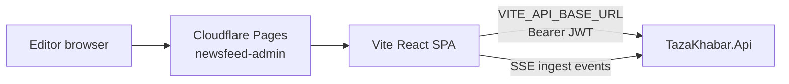
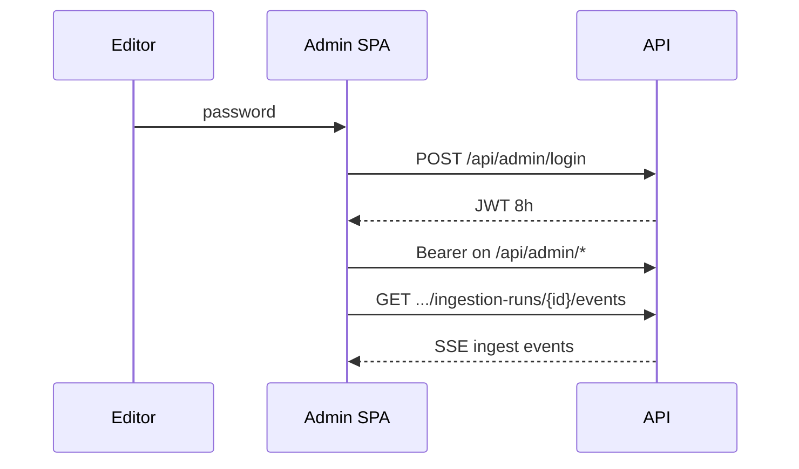

# Admin

> **Living doc** — update when admin routes, auth client behavior, or live-ingest UI change.  
> **Last verified against:** 2026-09-01 (password-only admin login)

## Purpose

Internal Vite + React SPA for editors: review queue, sources, uploads, ingestion logs, and live run terminal. Exception to the Expo-only reader rule ([ADR-006](../adr/006-internal-admin-spa.md)).

## Boundaries

- **In scope:** `apps/admin/**`, admin auth storage, SSE live dock.
- **Out of scope:** Public reader UX; API endpoint implementation details (link to [02-api](./02-api.md)).

## Context diagram

## Components / key types

| Path | Role |
|------|------|
| `/login` | `LoginPage.tsx` |
| `/` | `DashboardPage.tsx` |
| `/review` | `ReviewQueuePage.tsx` |
| `/uploads` | `UploadsPage.tsx` |
| `/articles/new`, `/articles/:id` | `ArticleEditorPage.tsx` |
| `/sources` | `SourcesPage.tsx` |
| `/logs` | `IngestionLogsPage.tsx` |
| `src/api.ts` | HTTP client |
| `src/auth.ts` | JWT in `sessionStorage` |
| `src/live/*` | `useIngestionStream`, `LiveRunDock`, `LiveTerminal` |

Stack: Vite 8 + React 19 + TypeScript + react-router-dom 7. Types from `@tazakhabar/shared-types`.

## Data & control flows

Session keys: `tazakhabar_admin_token`, `tazakhabar_admin_expires`, `tazakhabar_admin_identity`.

May copy **token values** (colors/spacing) from reader theme; own table/form components — do not embed reader cards.

Admin write payloads are validated server-side before endpoint logic touches values. Article create/publish/reject/archive actions append `ArticleAuditLog` rows; `ReviewedBy`/`ReviewedAt` remain the current-state fields on `Article`.

Source “run now” returns `202` after creating an `IngestionRun` plus durable `IngestionJob`; the background worker completes or fails it and live events stream against the run id.

## Key files

- `apps/admin/package.json`
- `apps/admin/src/App.tsx`, `src/main.tsx`
- `apps/admin/src/api.ts`, `src/auth.ts`
- `apps/admin/src/live/*`
- `apps/admin/.env.example`

## Public contracts

| Item | Value |
|------|-------|
| Env | `VITE_API_BASE_URL` (default `http://localhost:8080`) |
| Login | `POST /api/admin/login` `{ password }` |
| Deploy | Cloudflare Pages project `newsfeed-admin` → `apps/admin/dist` |
| CORS | Admin origin must be in `Cors__AllowedOrigins__*` |

## Failure modes & invariants

- Do not ship admin routes inside `apps/app`.
- Shared password is not per-editor identity — `ReviewedBy` uses the fixed `Admin` identity.
- Audit history is append-only in `article_audit_logs`; do not rely only on mutable article status fields for action history.
- Login rate-limited server-side (5/IP/min).
- Separate Pages origin from reader.

## Related docs

- [ADR-005](../adr/005-admin-shared-credential.md), [ADR-006](../adr/006-internal-admin-spa.md)
- [04-ingestion](./04-ingestion.md)
- Specs: `docs/superpowers/specs/2026-08-13-admin-editorial-phase1-design.md`

## Change checklist

| When you change… | Update… |
|------------------|---------|
| Routes / auth / live UI | This page |
| Admin API contract | This page + [02-api](./02-api.md) + [07-shared-types](./07-shared-types.md) |
| Admin hosting project/env | [08-hosting-and-ci](./08-hosting-and-ci.md) |
