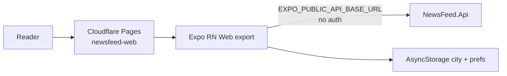
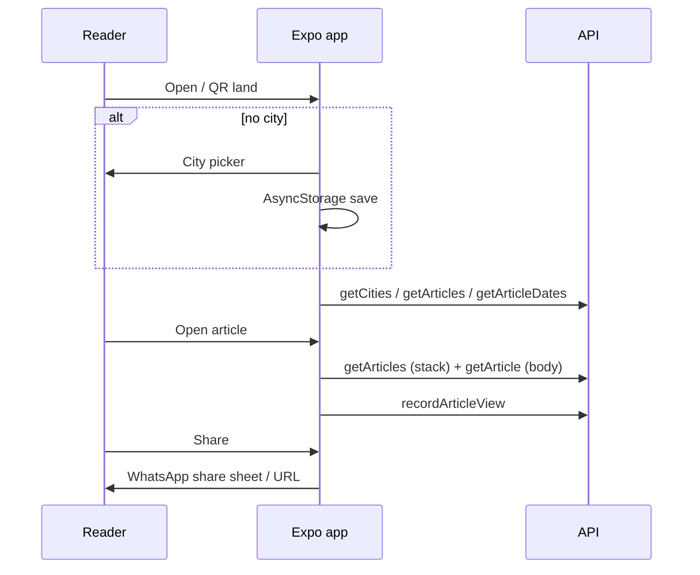

# Reader app

> **Living doc** — update when Expo routes, city/feed/share behavior, or desktop web layer change.  
> **Last verified against:** 2026-08-14 (swipe reader shows stored body)

## Purpose

Universal Expo client (`apps/app`) for readers: web/PWA now, native later. Phone-first localized feed with WhatsApp share ([ADR-003](../adr/003-expo-universal-client.md)).

## Boundaries

- **In scope:** Expo Router screens, API client, city preference, share, desktop layout, theme tokens, PWA assets.
- **Out of scope:** Admin tooling; API implementation.

## Context diagram

## Components / key types

### Routes (`apps/app/app/`)

| File | Role |
|------|------|
| `index.tsx` | Boot: stored city → tabs else `/city` |
| `city.tsx` | City picker |
| `(tabs)/index.tsx` | Home feed |
| `(tabs)/search.tsx` | Discover / search |
| `(tabs)/bookmarks.tsx` | Local bookmarks |
| `(tabs)/profile.tsx` | Settings / change city |
| `(tabs)/categories.tsx` | Hidden (`href: null`) |
| `article/[id].tsx` | Immersive vertical swipe pager; hydrates `body` via `getArticle` |
| `feed.tsx` | Legacy redirect → tabs |

### Modules

| Module | Role |
|--------|------|
| `src/api/client.ts` | Typed API calls |
| `src/storage/cityPreference.ts` | Persisted city |
| `src/utils/shareToWhatsApp.ts` | Share deep link / intent |
| `src/components/desktop/*` | Desktop shell / sidebar / hero row |
| `src/storage/viewSession.ts` | Anonymous view sessions for trending |
| `src/theme/tokens.ts` | Light shell `#FAFAFA`, accent `#1D7BFF` |
| `public/manifest.webmanifest`, `public/_headers` | PWA / Pages headers |

Stack: Expo ~54, expo-router, Gluestack UI, Moti, AsyncStorage.

## Data & control flows

API helpers used: `getHealth`, `getCities`, `getArticles`, `getArticleDates`, `getArticle`, `getTrendingArticles`, `recordArticleView`.

## Key files

- `apps/app/package.json`, `app.json` / Expo config
- `apps/app/src/api/client.ts`
- `apps/app/app/**`
- `apps/app/.env.example`

## Public contracts

| Item | Value |
|------|-------|
| Env | `EXPO_PUBLIC_API_BASE_URL`, `EXPO_PUBLIC_APP_ENV` |
| Deploy artifact | `pnpm build:web` → `apps/app/dist` |
| Pages project | default `newsfeed-web` |
| Auth | None for MVP |

## Failure modes & invariants

- Use RN primitives (`View`/`Text`/`Pressable`) so web and native stay aligned — avoid raw HTML/CSS except thin `Platform` forks.
- Do not add a second Vite reader app.
- MVP UI stays light + single blue accent until branding lands.
- No login — city preference is device-local only.
- List payloads omit `body`; the swipe card shows full plain-text `body` when `GET /api/articles/{id}` returns it, otherwise the summary.

## Related docs

- [ADR-002](../adr/002-no-auth-mvp.md), [ADR-003](../adr/003-expo-universal-client.md)
- [PRD](../PRD.md) core flows
- Spec: `docs/superpowers/specs/2026-08-13-responsive-desktop-web-layer-design.md`

## Change checklist

| When you change… | Update… |
|------------------|---------|
| Routes / feed / share / desktop | This page |
| Reader API usage / DTO fields | This page + [07-shared-types](./07-shared-types.md) |
| Pages deploy / headers | [08-hosting-and-ci](./08-hosting-and-ci.md) |
