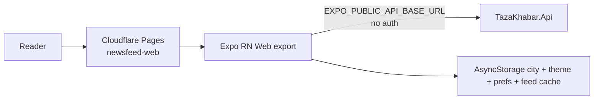
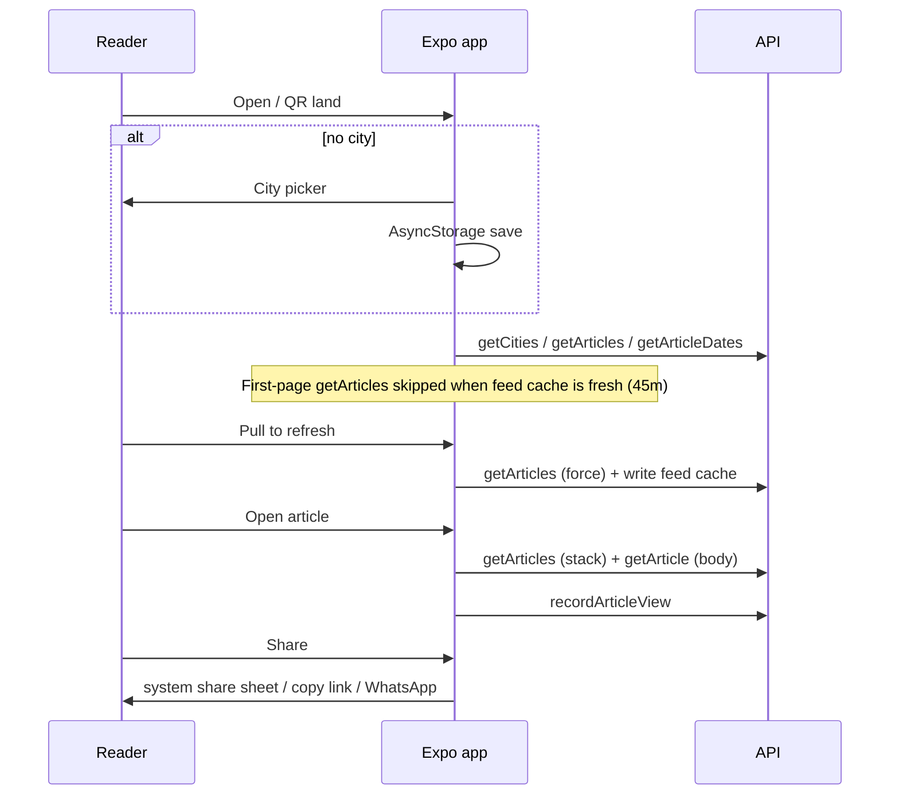

# Reader app

> **Living doc** — update when Expo routes, city/feed/share behavior, or desktop web layer change.  
> **Last verified against:** 2026-08-27 (public trust/support routes; Android PWA install; feed cache 45m TTL)

## Purpose

Universal Expo client (`apps/app`) for readers: web/PWA now, native later. Phone-first localized feed with WhatsApp share ([ADR-003](../adr/003-expo-universal-client.md)).

Build **mobile-first** (touch targets, feed density, bottom tabs) while keeping breakpoint responsiveness: tablet pairing and desktop sidebar/rail remain active from `useBreakpoint`.

On mobile, the top bar and category rail sit outside the only vertical scroll
surface, the virtualized feed. The bottom tab bar remains in the navigator shell
(Home, Bookmarks, Profile — Discover is hidden from the tab bar for now),
so browser/body scrolling never moves either navigation region. Feed cards follow
a Google News pattern on a TazaKhabar canvas (light or dark): photo stories at a regular
cadence become featured (large rounded image, circular source mark); the next
cluster is a horizontal related strip; remaining stories are compact rows with a
source avatar, right-aligned thumb when present, and a See more pill. Save /
Share / Read original live in the overflow sheet (Google News copy: Save for later,
Go to [source], I like this), not on the card face. Tab scenes fade in on focus;
articles open with a fade-from-bottom; city picker slides from the right. Tablet
and desktop retain denser rows and the desktop content rail.

The compact web shell does not add native safe-area padding below the tab bar;
native layouts retain device safe-area padding. The web document also keeps
browser text-size adjustment at 100% so mobile browsers do not inflate the
reader beyond the intended responsive scale.

## Boundaries

- **In scope:** Expo Router screens, API client, city preference, share, desktop layout, theme tokens, PWA assets.
- **Out of scope:** Admin tooling; API implementation.

## Context diagram

## Components / key types

### Routes (`apps/app/app/`)

| File | Role |
|------|------|
| `index.tsx` | Boot: stored city → tabs else `/city` |
| `city.tsx` | City picker (search, selected row, onboarding vs change-city copy) |
| `(tabs)/index.tsx` | Home feed |
| `(tabs)/search.tsx` | Search / Discover (hidden from tab bar; opened from home search) |
| `(tabs)/bookmarks.tsx` | Local bookmarks |
| `(tabs)/profile.tsx` | Settings: city, appearance (Light/Dark/System), language, blocks |
| `(tabs)/categories.tsx` | Hidden (`href: null`) |
| `article/[id].tsx` | Continuous editorial article feed; hydrates `body` via `getArticle`; Back returns to Home |
| `about.tsx`, `privacy.tsx`, `terms.tsx` | Public product, privacy, and legal information |
| `support.tsx`, `corrections.tsx` | Reader support plus editorial correction/takedown process |
| `feed.tsx` | Legacy redirect → tabs |

### Modules

| Module | Role |
|--------|------|
| `src/api/client.ts` | Typed API calls |
| `src/api/useAsyncResource.ts` | Shared async lifecycle hook for ordinary server-state reads |
| `src/storage/cityPreference.ts` | Persisted city (`AsyncStorage`; device-local, no account) |
| `src/storage/feedCache.ts` | First-page Home/Discover feed cache (`AsyncStorage`; 45m TTL; key = city+category+lang+q) |
| `src/components/CityListItem.tsx` | Tappable city row + list skeleton |
| `src/components/CitySearch.tsx` | Live city/state filter field |
| `src/utils/shareToWhatsApp.ts` | Share deep link / intent |
| `src/components/desktop/*` | Desktop shell / sidebar / hero row |
| `src/storage/viewSession.ts` | Anonymous view sessions for trending |
| `src/preferences/ThemePreferenceContext.tsx` | Light/dark/system preference → `useTheme()` (`colors`, `readerColors`, `shadows`) |
| `src/theme/tokens.ts` | Shell palettes (light `#F4F6FA` / Google News grey dark `#202124`) + accent `#155EEF` (`accentFill`) |
| `src/theme/readerTokens.ts` | Article reader palette per color scheme |
| `src/components/CompactArticleCard.tsx` | Google News–style list card (thumb when image, text-only otherwise) + See more + skeleton |
| `src/components/BreakingHeroCard.tsx` | Top story: rounded image, circular source mark, headline/time |
| `src/components/RelatedStoriesStrip.tsx` | Horizontal related cluster under a featured card |
| `src/utils/feedLayout.ts` | Mixed mobile feed (featured / related / compact) |
| `public/manifest.webmanifest`, `public/sw.js`, `public/_headers` | PWA installability (manifest + service worker) / Pages headers |
| `src/components/AddToHomeBanner.tsx` | Soft install hint after city pick; Android **Install** uses `beforeinstallprompt` |
| `src/pwa/installPrompt.ts` | Captures Chromium install event; `promptInstall()` opens the native dialog |
| `src/pwa/registerWebServiceWorker.ts` | Registers `/sw.js` on web only (never Expo native) |
| `src/utils/shouldOfferAddToHome.ts` | A2HS only on **mobile web browsers**; never Expo native; never installed PWA (`display-mode: standalone` / iOS `navigator.standalone`) |
| `src/components/PublicInfoScreen.tsx`, `src/content/publicPages.ts` | Shared native-safe public information pages and launch policy copy |

Stack: Expo ~54, expo-router, Gluestack UI, Moti, AsyncStorage.

Server state convention: ordinary API reads should go through `useAsyncResource`
or a feature hook built on it. Keep imperative `useState`/`useEffect` loaders only
where pagination, body prefetching, or fire-and-forget mutations make the flow
meaningfully different. Home and Discover first-page lists use `src/storage/feedCache.ts`
so a reopen / tab return within **45 minutes** reuses the last successful fetch
(no network). Pull-to-refresh always hits the API and overwrites the cache. Changing
city, category, language, or Discover query uses a different cache key (fetch if that
key is missing or stale). Expired cache still paints immediately while a background
refresh runs (stale-while-revalidate). Pagination `append` is never served from cache.
Revisit TanStack Query when cross-screen invalidation or offline-first sync becomes
product-critical beyond this first-page policy.

## Data & control flows

API helpers used: `getHealth`, `getCities`, `getArticles`, `getArticleDates`, `getArticle`, `getTrendingArticles`, `recordArticleView`.

## Key files

- `apps/app/package.json`, `app.json` / Expo config
- `apps/app/eas.json` — optional EAS profiles (local Gradle is the default APK path)
- `apps/app/src/api/client.ts`
- `apps/app/app/**`
- `apps/app/.env.example`, `apps/app/.env.production`

## Public contracts

| Item | Value |
|------|-------|
| Env | `EXPO_PUBLIC_API_BASE_URL`, `EXPO_PUBLIC_APP_ENV`, `EXPO_PUBLIC_SUPPORT_EMAIL` |
| Deploy artifact | `pnpm build:web` → `apps/app/dist` |
| Bundle report | `pnpm --filter @tazakhabar/app bundle:report` |
| Android APK (local) | `pnpm build:apk` → `expo prebuild` + `gradlew assembleRelease` → `apps/app/android/app/build/outputs/apk/release/app-release.apk` |
| Native project | `apps/app/android/` generated, gitignored; regenerate with `pnpm --filter @tazakhabar/app prebuild:android` |
| Pages project | `newsfeed-web` |
| Auth | None for MVP |

For ordinary reader UI development, `apps/app/.env.example` targets the hosted
Render API. This avoids requiring a local .NET API, Postgres, or Docker. API
work can opt into `http://localhost:8080` in the ignored local `.env`, followed
by an Expo restart. The `web` script uses port `19006`, which is allowlisted by
the hosted API for browser development.

## Frontend quality baselines

- Bundle baseline after direct lucide icon imports:
  - Before: `5534.7 KiB` raw / `1049.0 KiB` gzip, `4670` Metro modules.
  - After: `3751.7 KiB` raw / `869.7 KiB` gzip, `2936` Metro modules.
  - Sourcemap check after the fix found `29` lucide sources instead of the full icon set; lucide no longer appears in the top generated-byte buckets.
- Gluestack import check: `@gluestack-ui/themed` publishes a top-level `build/index.js` and `build/components/index.js`, with no supported per-component export map equivalent to `lucide-react-native/icons/*`. Keep usage scoped at call sites, but treat `react-aria` / `react-stately` weight as inherent unless the library is replaced or removed.
- Desktop popover keyboard baseline: `StoryOptionsPopover` traps Tab/Shift+Tab within action rows, focuses the first action on open, restores focus to the trigger on close, and activates focused actions with Enter/Space. Jest coverage lives in `apps/app/__tests__/storyOptionsPopover.test.tsx`.
- Contrast baseline: `apps/app/__tests__/contrast.test.ts` checks normal text and UI contrast for light feed tokens, category badges, destructive affordances, and the dark reader palette. Token changes must keep WCAG AA thresholds.
- Font scaling baseline: `apps/app/src/accessibility/defaultTextScaling.ts` sets RN `Text` and `TextInput` defaults to allow OS font scaling up to `2` (200%).
- Static screen-reader label/role sweep: all current `Pressable` call sites under `apps/app/app` and `apps/app/src` have matching role/label coverage as of this verification.

Manual verification still required before claiming a comprehensive a11y sweep is complete: VoiceOver/TalkBack spot-checks on Home feed and Article detail, plus one desktop-only interaction (popover or sidebar nav), on a real device or named simulator/emulator.

## Failure modes & invariants

- Use RN primitives (`View`/`Text`/`Pressable`) so web and native stay aligned — avoid raw HTML/CSS except thin `Platform` forks.
- Do not add a second Vite reader app.
- Appearance: Light / Dark / System (default System), persisted in AsyncStorage; Profile controls it. Brand accent fill stays `#155EEF`.
- No login — city, theme, and first-page feed cache are device-local only.
- Feed cache: first page only; TTL 45 minutes; max 16 key entries (LRU). Fresh cache skips the network until pull-to-refresh or key change (city / category / language / Discover `q`). Stale cache paints then revalidates.
- List payloads omit `body`; the reader shows full plain-text `body` when `GET /api/articles/{id}` returns it, otherwise the summary. For translated reads, the API suppresses original-language `body` so the story shows translated headline/summary rather than mixing languages.
- The article screen uses Reels-style vertical paging: each story is one viewport-tall page so two stories never share the screen. A scroll gesture snaps to the next story with a slower eased transition on web (~700ms; instant when the reader prefers reduced motion). Native paging uses the normal deceleration rate rather than the snappy `fast` default. Short stories pad to fill the page; longer stories scroll inside that page. Story content starts below the opaque top bar so hero images (including e-paper mastheads) do not bleed through the chrome. Publisher download CTAs such as “Download in high quality” are stripped from body copy. Later stories append as the reader approaches the end. The FlatList is the only paging surface (`flex: 1` inside an overflow-clipped root); the sticky top bar and compact bottom action bar sit outside that list (viewport-fixed on web) so chrome does not move with story content. Share and Save live only in that bottom bar — not duplicated in the story body.
- Active story is detected with FlatList viewability (and an IntersectionObserver sentinel on web). `6 of 8` updates from that active item. On web the `/article/:id` path is `history.replaceState`’d while reading. The article Back control always `replace`s to Home (`/(tabs)`) so history never drops the reader on Discover.
- Source URLs appear once as “Read original article” near the headline. Publisher name stays in metadata as plain text. Only valid `https` URLs become that link.
- Share prefers the platform share sheet, then copy-link; WhatsApp remains an optional destination rather than the only action.

## Related docs

- [ADR-002](../adr/002-no-auth-mvp.md), [ADR-003](../adr/003-expo-universal-client.md)
- [PRD](../PRD.md) core flows
- Spec: `docs/superpowers/specs/2026-08-13-responsive-desktop-web-layer-design.md`

## Change checklist

| When you change… | Update… |
|------------------|---------|
| Routes / feed / share / desktop | This page |
| Reader API usage / DTO fields | This page + [07-shared-types](./07-shared-types.md) |
| Pages deploy / headers | [08-hosting-and-ci](./08-hosting-and-ci.md) |
