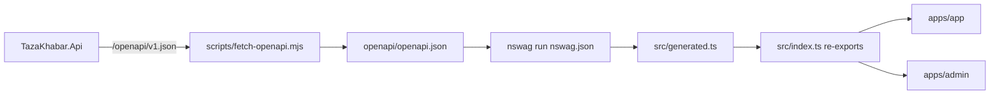

# Shared types

> **Living doc** — update when OpenAPI generation, NSwag config, or contract PR rules change.  
> **Last verified against:** 2026-09-01 (password-only admin login contract)

## Purpose

Keep TypeScript DTOs for reader and admin in lockstep with the API OpenAPI document via NSwag — no hand-maintained parallel types.

## Boundaries

- **In scope:** `packages/shared-types`, fetch/generate scripts, committed OpenAPI snapshot.
- **Out of scope:** Runtime API behavior; hand-written UI-only types that are not API contracts.

## Context diagram



## Components / key types

| Path | Role |
|------|------|
| `packages/shared-types/openapi/openapi.json` | Committed snapshot |
| `packages/shared-types/nswag.json` | DTO interfaces only → `src/generated.ts` |
| `packages/shared-types/src/generated.ts` | **Generated — do not hand-edit** |
| `packages/shared-types/src/index.ts` | Selected re-exports |
| `packages/shared-types/scripts/fetch-openapi.mjs` | Pulls `OPENAPI_URL` or `http://localhost:8080/openapi/v1.json` |
| `packages/shared-types/scripts/generate.mjs` | Runs NSwag |

## Data & control flows

```bash
# API must be running (or OPENAPI_URL set)
pnpm --filter @tazakhabar/shared-types fetch-openapi
pnpm generate:types
```

Same PR must include: API change + OpenAPI snapshot + `generated.ts` + consumer updates (`apps/app` and/or `apps/admin`).

CI starts the API after the backend build, fetches `/openapi/v1.json`, and diffs it against `packages/shared-types/openapi/openapi.json`; API contract PRs fail when the committed snapshot is stale.

## Key files

- `packages/shared-types/package.json`
- `packages/shared-types/nswag.json`
- Root script `generate:types` in `package.json`

## Public contracts

Consumers import from `@tazakhabar/shared-types` only through the package `index` surface. Breaking DTO changes require coordinated client updates in the same PR (architecture hard rule).

`CityResponse` includes `latitude` and `longitude` from the API contract so the
Expo reader can calculate the nearest supported city without uploading a
reader's location.

## Failure modes & invariants

- Hand-editing `generated.ts` causes silent drift — always regenerate.
- Fetching OpenAPI from a stale or wrong environment publishes the wrong contract — prefer local running API for generation during feature work.
- Do not publish shared-types as an independent versioned npm package for MVP; workspace dependency only.

## Related docs

- [02-api](./02-api.md), [01-monorepo](./01-monorepo.md)
- [ADR-001](../adr/001-monorepo.md)

## Change checklist

| When you change… | Update… |
|------------------|---------|
| OpenAPI / NSwag / export surface | This page |
| New consumer of shared-types | [01-monorepo](./01-monorepo.md) if package graph changes |
