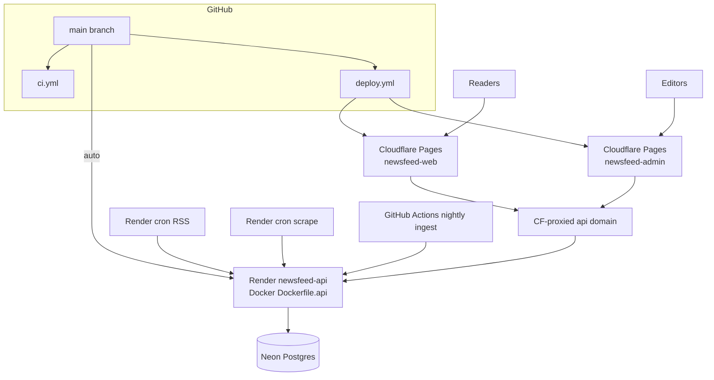

# Hosting and CI

> **Living doc** — update when Render, Cloudflare, Neon, Docker, workflows, or env templates change.  
> **Last verified against:** 2026-08-26 (OpenAiRewrite Enabled flag)

## Purpose

How NewsFeed is built, deployed, and wired in production: Render API + crons, Cloudflare Pages (reader + admin), Neon Postgres, GitHub Actions, local Docker.

## Boundaries

- **In scope:** `render.yaml`, Dockerfiles, `docker-compose.yml`, `.github/workflows/*`, env example templates, traffic/CDN caching.
- **Out of scope:** App feature behavior (see other atlas pages).

## Context diagram

## Components / key types

| Piece | File / service |
|-------|----------------|
| API image | `infra/docker/Dockerfile.api` |
| Optional web nginx preview | `infra/docker/Dockerfile.web`, `nginx.web.conf` |
| Blueprint | `render.yaml` — web `newsfeed-api` + ingest/purge crons |
| Local DB | `docker-compose.yml` Postgres 16 |
| CI | `.github/workflows/ci.yml` — API format/build/test + Postgres, migration SQL artifact, OpenAPI drift check; app lint/test/export; admin build |
| Deploy | `.github/workflows/deploy.yml` — Pages for web + admin; API via Render auto-deploy |
| DB migration workflow | `.github/workflows/migrate-production.yml` — manual production EF migration apply |
| Env templates | `.env.example`, `.env.staging.example`, `.env.production.example`, `apps/app/.env.example`, `apps/admin/.env.example` |

No `wrangler.toml` in-repo — Pages deploy uses `cloudflare/pages-action` (wrangler 3) in Actions. Cache/security headers via each app’s `public/_headers`.

## Data & control flows

### Production traffic

1. Static assets: browser → Cloudflare Pages CDN.
2. JSON: browser → Cloudflare-proxied `api.<domain>` → Render Docker.
3. `GET /api/articles` and `GET /api/cities` send `Cache-Control: public, max-age=60` so the edge can cut Neon load ([ADR-004](../adr/004-render-cloudflare-neon-hosting.md)).
4. Render crons hit the 45m ingest endpoints with `X-Ingest-Key`; GitHub Actions runs the nightly midnight IST batch and calls `/api/ingest/daily` with the same key.

### Render web service

- Health: `/healthz`
- Port: `8080`
- Secrets in dashboard (`sync: false`): DB, CORS origins, ingest secret, admin password/JWT key, Claude key, OpenAI rewrite key, upload root.
- Production API boot does not apply EF migrations. Review the CI SQL artifact, then run `Migrate Production Database` manually.

## Key files

- `render.yaml`
- `.github/workflows/ci.yml`, `deploy.yml`
- `infra/docker/*`
- `docker-compose.yml`

## Public contracts

### Env vars (production-oriented)

| Var | Where |
|-----|-------|
| `ConnectionStrings__Database` | Render |
| `Cors__AllowedOrigins__0` / `__1` | Render (reader + admin origins) |
| `RateLimiting__PermitLimit` / `WindowSeconds` | Render (defaults 60/60) |
| `RssIngest__Secret` | Render + crons + GitHub Actions nightly ingest |
| `Admin__Password`, `Admin__JwtSigningKey` | Render |
| `ArticleIntelligence__ApiKey` / `BaseUrl` / `Model` | Render |
| `OpenAiRewrite__ApiKey` / `BaseUrl` / `Model` / `Enabled` | Render |
| `Upload__RootPath` | Render |
| `IngestHealth__MaxSilenceMinutes`, `IngestHealth__AlertWebhookUrl` | Render |
| `INGEST_URL` | Render cron services and GitHub Actions `nightly-ingest.yml` |
| `EXPO_PUBLIC_API_BASE_URL` | GitHub Actions **and** `apps/app/.env.production` (Expo inlines this at export) |
| `VITE_API_BASE_URL` | GitHub Actions **and** `apps/admin/.env.production` |
| `CLOUDFLARE_API_TOKEN`, `CLOUDFLARE_ACCOUNT_ID` | GitHub secrets |
| `CLOUDFLARE_PAGES_PROJECT_NAME` | default `newsfeed-web` |
| `CLOUDFLARE_PAGES_ADMIN_PROJECT_NAME` | default `newsfeed-admin` |
| `PRODUCTION_DATABASE_CONNECTION_STRING` | GitHub production environment secret for manual migration workflow |

## Failure modes & invariants

- API deploys are owned by Render, not the Pages deploy job.
- **Do not let Cloudflare dashboard Git builds replace Actions without env.** Connecting the repo in Pages Settings starts a second pipeline that does **not** see GitHub `vars.EXPO_PUBLIC_API_BASE_URL`. Expo then ships `EXPO_PUBLIC_API_BASE_URL is not configured`. Prefer: pause Pages automatic deployments and keep `.github/workflows/deploy.yml`. If Git builds stay on, set production env `EXPO_PUBLIC_API_BASE_URL`, build command `corepack enable && pnpm install --frozen-lockfile && pnpm --filter @newsfeed/app build:web`, output `apps/app/dist`.
- Edge caching implies up to ~60s feed staleness — tune deliberately.
- `.github/workflows/nightly-ingest.yml` runs at `30 18 * * *` UTC (00:00 IST) and calls `/api/ingest/daily`, which avoids Claude summarization and OpenAI scrape rewrite.
- Staging Render/Neon deferred; when added, separate service + Neon branch/project.
- Never commit real secrets; only `*.example` templates.
- Local tools must not point at production Neon.
- Production admin password must be non-default and at least 12 chars; JWT signing key must be non-default and at least 32 chars.
- Before launch, confirm Neon backup retention in the dashboard and perform a real restore test into a non-production branch/project. Record date, source backup, target branch/project, migration version, and smoke-test result in the PR or release notes.

## Related docs

- [ADR-004](../adr/004-render-cloudflare-neon-hosting.md)
- Spec: `docs/superpowers/specs/2026-08-03-render-cloudflare-hosting-design.md`
- [00-system-overview](./00-system-overview.md)

## Change checklist

| When you change… | Update… |
|------------------|---------|
| `render.yaml` / Docker / workflows / env examples | This page |
| CDN cache headers or API domain setup | This page + [02-api](./02-api.md) if header/TTL code changes |
| New hosted surface | This page + [00-system-overview](./00-system-overview.md) |
