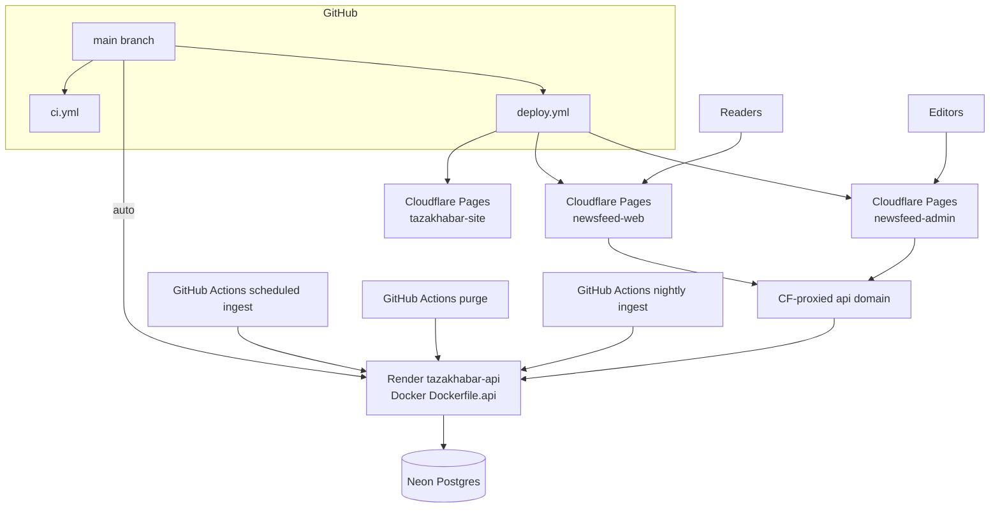

# Hosting and CI

> **Living doc** — update when Render, Cloudflare, Neon, Docker, workflows, or env templates change.  
> **Last verified against:** 2026-09-01 (RSS batch size 50; national publisher feeds for all cities)

## Purpose

How TazaKhabar is built, deployed, and wired in production: Render API (free tier), Cloudflare Pages (reader + marketing site + admin), Neon Postgres, GitHub Actions schedulers, local Docker.

## Boundaries

- **In scope:** `render.yaml`, Dockerfiles, `docker-compose.yml`, `.github/workflows/*`, env example templates, traffic/CDN caching.
- **Out of scope:** App feature behavior (see other atlas pages).

## Context diagram

## Components / key types

| Piece | File / service |
|-------|----------------|
| API image | `infra/docker/Dockerfile.api` |
| Frontend containers | `infra/docker/Dockerfile.frontend-dev` (hot reload), `Dockerfile.web` (static preview) |
| Android APK builder | `infra/docker/Dockerfile.android`, invoked by `scripts/docker-build-apk.sh` |
| Blueprint | `render.yaml` — web `tazakhabar-api` only (free tier; no Render crons) |
| Local stack | `docker-compose.yml` Postgres 16 + API + Expo reader; optional `tools` profile for admin/site |
| CI | `.github/workflows/ci.yml` — API format/build/test + Postgres, migration SQL artifact, OpenAPI drift check; app lint/test/export; marketing site build; admin build |
| Deploy | `.github/workflows/deploy.yml` — Pages for reader + marketing site + admin; API via Render auto-deploy |
| Scheduled ingest | `.github/workflows/scheduled-ingest.yml` — RSS + scrape every 15 min (free-tier scheduler) |
| Article purge | `.github/workflows/purge-old-articles.yml` — daily retention purge |
| Nightly ingest | `.github/workflows/nightly-ingest.yml` — midnight IST full batch |
| DB migration workflow | `.github/workflows/migrate-production.yml` — manual production EF migration apply |
| Env templates | `.env.example`, `.env.staging.example`, `.env.production.example`, `apps/app/.env.example`, `apps/admin/.env.example`, `apps/site/.env.example` |

No `wrangler.toml` in-repo — Pages deploy uses `cloudflare/pages-action` (wrangler 3) in Actions. Cache/security headers via each app’s `public/_headers`.

## Data & control flows

### Docker-only local development

1. `docker compose up --build` starts Postgres, waits for its health check,
   starts the .NET API, then starts Expo web with host source mounted for hot
   reload.
2. The browser loads the reader at `localhost:19006` and calls the API at
   `localhost:8080`; only the API connects to Postgres over the Compose network.
3. `docker compose --profile tools up --build` additionally exposes admin on
   `5173` and the marketing site on `5174`.
4. Frontend dependency directories and pnpm stores use named volumes, so pnpm
   is not required on the host and dependencies do not pollute the bind mount.

The `apk` Compose build profile (also wrapped by
`scripts/docker-build-apk.sh`) is separate from the running stack. It builds a
Linux/amd64 image containing JDK 17 and Android API 36, runs Expo prebuild plus
Gradle `assembleRelease`, and exports only
`artifacts/android/tazakhabar-release.apk` to the host. The output uses the
generated debug keystore for sideload testing, not Play Store signing.

### Production traffic

1. Static assets: browser → Cloudflare Pages CDN.
2. JSON: browser → Cloudflare-proxied `api.<domain>` → Render Docker.
3. `GET /api/articles` and `GET /api/cities` send `Cache-Control: public, max-age=60` so the edge can cut Neon load ([ADR-004](../adr/004-render-cloudflare-neon-hosting.md)).
4. GitHub Actions hits ingest endpoints every 15 minutes with `X-Ingest-Key` (wakes free-tier API + runs RSS/scrape batches). Nightly midnight IST runs `/api/ingest/daily`; daily purge runs at 03:00 UTC. In-process `ScheduledIngestHostedService` also runs while the instance is awake.

### Pages deployment hygiene

- `newsfeed-web.pages.dev` is the only canonical reader frontend deployment.
  Keep it on the Cloudflare Pages project `newsfeed-web`.
- Manual Wrangler reader deploys that should go live must target
  `newsfeed-web` with `--branch main` and directory `apps/app/dist`.
- Feature-branch Pages deployment URLs are temporary previews. After production
  is verified, prune stale preview and old immutable deployment URLs from
  `newsfeed-web` so agents and operators do not confuse them with the main
  frontend.
- Do not delete `tazakhabar-site` or `newsfeed-admin` when consolidating reader
  frontend deployments; those are distinct hosted surfaces.

### Render web service

- Health: `/healthz`
- Port: `8080`
- Secrets in dashboard (`sync: false`): DB, CORS origins, ingest secret, admin password/JWT key, Claude key, OpenAI rewrite key, upload root.
- Production applies pending EF migrations on API boot (same as dev/test). Review the CI SQL artifact before merging schema PRs; the manual `Migrate Production Database` workflow remains available for pre-deploy applies.

## Key files

- `render.yaml`
- `.github/workflows/ci.yml`, `deploy.yml`
- `infra/docker/*`
- `docker-compose.yml`

## Public contracts

### Env vars (production-oriented)

| Var | Where |
|-----|-------|
| `ConnectionStrings__Database` | Render |
| `Cors__AllowedOrigins__0` / `__1` | Render (reader + admin origins) |
| `RateLimiting__PermitLimit` / `WindowSeconds` | Render (defaults 60/60) |
| `RssIngest__Secret` | Render API + GitHub Actions (`scheduled-ingest`, `nightly-ingest`, `purge-old-articles`) |
| `Admin__Password`, `Admin__JwtSigningKey` | Render |
| `ArticleIntelligence__ApiKey` / `BaseUrl` / `Model` | Render |
| `OpenAiRewrite__ApiKey` / `BaseUrl` / `Model` / `Enabled` | Render |
| `Upload__RootPath` | Render |
| `IngestHealth__MaxSilenceMinutes`, `IngestHealth__AlertWebhookUrl` | Render |
| `IngestSchedule__Enabled`, `IngestSchedule__RssIntervalMinutes`, `IngestSchedule__RssMaxSourcesPerRun`, `IngestSchedule__ScrapeIntervalMinutes` | Render API (in-process scheduler while instance is awake) |
| `EXPO_PUBLIC_API_BASE_URL` | GitHub Actions **and** `apps/app/.env.production` (Expo inlines this at export) |
| `EXPO_PUBLIC_SITE_URL` | GitHub Actions production variable for reader links to the public website |
| `VITE_API_BASE_URL` | GitHub Actions **and** `apps/admin/.env.production` |
| `VITE_READER_URL`, `VITE_SITE_URL`, `VITE_SUPPORT_EMAIL` | GitHub Actions production variables for the marketing site |
| `CLOUDFLARE_API_TOKEN`, `CLOUDFLARE_ACCOUNT_ID` | GitHub **production** environment secrets (required — Deploy fails if either is missing) |
| `CLOUDFLARE_PAGES_PROJECT_NAME` | default `newsfeed-web` (existing Cloudflare Pages project) |
| `CLOUDFLARE_PAGES_SITE_PROJECT_NAME` | default `tazakhabar-site` (marketing Pages project) |
| `CLOUDFLARE_PAGES_ADMIN_PROJECT_NAME` | default `newsfeed-admin` (existing Cloudflare Pages project) |
| `PRODUCTION_DATABASE_CONNECTION_STRING` | GitHub production environment secret for manual migration workflow |

## Failure modes & invariants

- API deploys are owned by Render, not the Pages deploy job.
- **Do not let Cloudflare dashboard Git builds replace Actions without env.** Connecting the repo in Pages Settings starts a second pipeline that does **not** see GitHub `vars.EXPO_PUBLIC_API_BASE_URL`. Expo then ships `EXPO_PUBLIC_API_BASE_URL is not configured`. Prefer: pause Pages automatic deployments and keep `.github/workflows/deploy.yml`. The workflow calls the stable root scripts (`pnpm build:web` / `pnpm build:admin`) so package renames do not leave stale filters behind. If Git builds stay on, set production env `EXPO_PUBLIC_API_BASE_URL`, build command `corepack enable && pnpm install --frozen-lockfile && pnpm build:web`, output `apps/app/dist`.
- Edge caching implies up to ~60s feed staleness — tune deliberately.
- `.github/workflows/nightly-ingest.yml` runs at `30 18 * * *` UTC (00:00 IST) and calls `/api/ingest/daily`, which avoids Claude summarization and OpenAI scrape rewrite.
- Staging Render/Neon deferred; when added, separate service + Neon branch/project.
- Never commit real secrets; only `*.example` templates.
- Local tools must not point at production Neon.
- Production admin password must be non-default and at least 12 chars; JWT signing key must be non-default and at least 32 chars.
- Before launch, confirm Neon backup retention in the dashboard and perform a real restore test into a non-production branch/project. Record date, source backup, target branch/project, migration version, and smoke-test result in the PR or release notes.

## Related docs

- [ADR-004](../adr/004-render-cloudflare-neon-hosting.md)
- Spec: `docs/superpowers/specs/2026-08-03-render-cloudflare-hosting-design.md`
- [00-system-overview](./00-system-overview.md)

## Change checklist

| When you change… | Update… |
|------------------|---------|
| `render.yaml` / Docker / workflows / env examples | This page |
| CDN cache headers or API domain setup | This page + [02-api](./02-api.md) if header/TTL code changes |
| New hosted surface | This page + [00-system-overview](./00-system-overview.md) |
