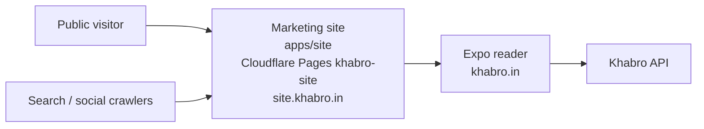

# Marketing site

> **Living doc** — update when the public website, legal routes, or reader handoff changes.  
> **Last verified against:** 2026-09-16 (public contact route and support email for Play News policy)

## Purpose

Describe the standalone public-facing Khabro website that explains the product, hosts launch formalities, and links into the Expo reader without embedding those pages inside the app.

## Boundaries

- **In scope:** `apps/site`, public/legal copy, OG asset, Cloudflare Pages marketing deployment, reader handoff links, public SEO surfaces (`robots.txt`, `sitemap.xml`, per-route meta/JSON-LD).
- **Out of scope:** Reader feed behavior (`06-reader-app.md`), admin tooling, API internals, indexing of article summary pages (reader SPA article routes stay `noindex`).

## Context diagram

## Components / key types

| Piece | Role |
|-------|------|
| `apps/site` | Vite + React marketing surface for public presentation |
| `/`, `/about`, `/contact`, `/privacy`, `/terms`, `/support`, `/corrections` | Public routes handled by the site SPA and Cloudflare `_redirects` |
| `src/seo-pages.json` + `src/seo.ts` | Shared titles/descriptions used at runtime and build-time prerender |
| `scripts/prerender-seo.mjs` | After `vite build`, writes per-route `index.html` shells with canonical/OG/Twitter/JSON-LD |
| `public/robots.txt`, `public/sitemap.xml` | Crawl directives and URL inventory (regenerated into `dist` on build) |
| `public/_headers` | Security headers and CSP for the marketing surface |
| `public/og.png` | Social preview image used by Open Graph / Twitter metadata |
| `VITE_READER_URL` | Handoff target to the production reader |
| `VITE_SITE_URL` | Canonical public site origin used in metadata |
| `VITE_SUPPORT_EMAIL` | Public contact address shown on contact/support-oriented pages; defaults to `contact@khabro.in` |

## Data & control flows

1. Public visitor opens the marketing site at `https://site.khabro.in` (Cloudflare Pages project `khabro-site`).
2. The site explains product value, trust standards, and launch context.
3. Contact/legal/support routes are shareable URLs on the same public site, linked with real `<a href>` anchors for crawl discovery.
4. Build emits static HTML per public path so social/search crawlers receive correct title, description, canonical, and structured data without relying on client-side meta mutation alone.
5. Reader CTAs send visitors to the Expo reader at `khabro.in`.
6. The Expo reader links back out to the public site for privacy, support, and related formalities.

## Key files

- `apps/site/src/App.tsx`
- `apps/site/src/seo.ts`, `apps/site/src/seo-pages.json`
- `apps/site/scripts/prerender-seo.mjs`
- `apps/site/src/styles.css`
- `apps/site/public/_redirects`
- `apps/site/public/_headers`
- `apps/site/public/robots.txt`
- `apps/site/public/sitemap.xml`
- `.github/workflows/deploy.yml`

## Public contracts

| Item | Value |
|------|-------|
| Site build | `pnpm build:site` (includes SEO prerender) |
| Deploy artifact | `apps/site/dist` |
| Pages project | `khabro-site` → custom domain `site.khabro.in` |
| Reader handoff env | `VITE_READER_URL`, `EXPO_PUBLIC_SITE_URL` |
| Public URLs | `/about`, `/contact`, `/privacy`, `/terms`, `/support`, `/corrections` |
| Crawl | `https://site.khabro.in/robots.txt`, `https://site.khabro.in/sitemap.xml` |

## Failure modes & invariants

- The marketing site is a separate public surface, not a second reader client.
- The Expo reader remains the only Khabro reader codebase for web and native.
- Contact/legal/support content must stay externally linkable and not depend on in-app Expo routes.
- Privacy copy must disclose optional foreground location permission and accurately state that nearest-city matching remains on-device.
- The public contact email must remain visible on `/contact` and support-oriented pages so app-store policy reviewers can find developer contact information without relying on social accounts.
- Public navigation must remain real hyperlinks (`href`) so crawlers can discover routes without executing SPA button handlers.
- Per-route HTML shells in `dist/<path>/index.html` must stay aligned with `src/seo-pages.json`.

## Related docs

- [00-system-overview](./00-system-overview.md)
- [01-monorepo](./01-monorepo.md)
- [06-reader-app](./06-reader-app.md)
- [08-hosting-and-ci](./08-hosting-and-ci.md)
- [ADR-007](../adr/007-public-marketing-site.md)
