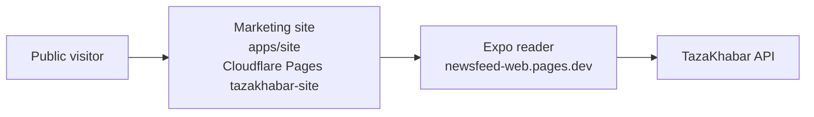

# Marketing site

> **Living doc** — update when the public website, legal routes, or reader handoff changes.  
> **Last verified against:** 2026-08-27 (separate Cloudflare Pages marketing site with standalone legal/support routes)

## Purpose

Describe the standalone public-facing TazaKhabar website that explains the product, hosts launch formalities, and links into the Expo reader without embedding those pages inside the app.

## Boundaries

- **In scope:** `apps/site`, public/legal copy, OG asset, Cloudflare Pages marketing deployment, reader handoff links.
- **Out of scope:** Reader feed behavior (`06-reader-app.md`), admin tooling, API internals.

## Context diagram

## Components / key types

| Piece | Role |
|-------|------|
| `apps/site` | Vite + React marketing surface for public presentation |
| `/`, `/about`, `/privacy`, `/terms`, `/support`, `/corrections` | Public routes handled by the site SPA and Cloudflare `_redirects` |
| `public/_headers` | Security headers and CSP for the marketing surface |
| `public/og.png` | Social preview image used by Open Graph / Twitter metadata |
| `VITE_READER_URL` | Handoff target to the production reader |
| `VITE_SITE_URL` | Canonical public site origin used in metadata |
| `VITE_SUPPORT_EMAIL` | Optional public contact address shown on support-oriented pages |

## Data & control flows

1. Public visitor opens the marketing site on its own `pages.dev` subdomain.
2. The site explains product value, trust standards, and launch context.
3. Legal/support routes are shareable URLs on the same public site.
4. Reader CTAs send visitors to the Expo reader at `newsfeed-web.pages.dev`.
5. The Expo reader links back out to the public site for privacy, support, and related formalities.

## Key files

- `apps/site/src/App.tsx`
- `apps/site/src/styles.css`
- `apps/site/public/_redirects`
- `apps/site/public/_headers`
- `.github/workflows/deploy.yml`

## Public contracts

| Item | Value |
|------|-------|
| Site build | `pnpm build:site` |
| Deploy artifact | `apps/site/dist` |
| Pages project | `tazakhabar-site` |
| Reader handoff env | `VITE_READER_URL`, `EXPO_PUBLIC_SITE_URL` |
| Public URLs | `/about`, `/privacy`, `/terms`, `/support`, `/corrections` |

## Failure modes & invariants

- The marketing site is a separate public surface, not a second reader client.
- The Expo reader remains the only TazaKhabar reader codebase for web and native.
- Legal/support content must stay externally linkable and not depend on in-app Expo routes.
- Support email can be empty at launch; the site must render a clear fallback message instead of inventing contact details.

## Related docs

- [00-system-overview](./00-system-overview.md)
- [01-monorepo](./01-monorepo.md)
- [06-reader-app](./06-reader-app.md)
- [08-hosting-and-ci](./08-hosting-and-ci.md)
- [ADR-007](../adr/007-public-marketing-site.md)
