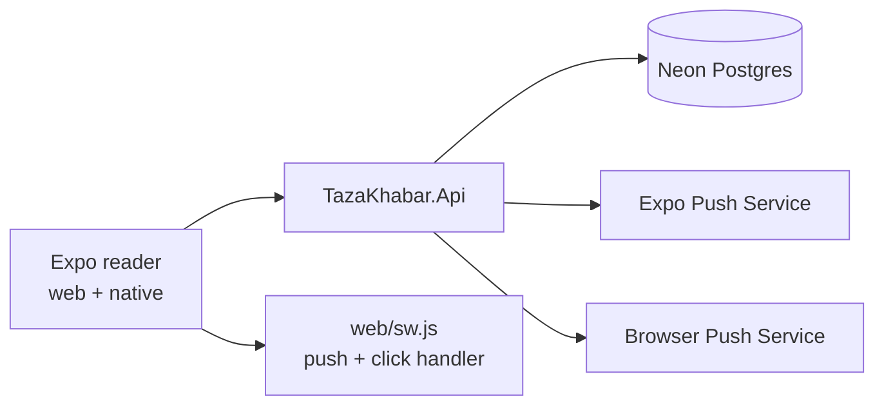
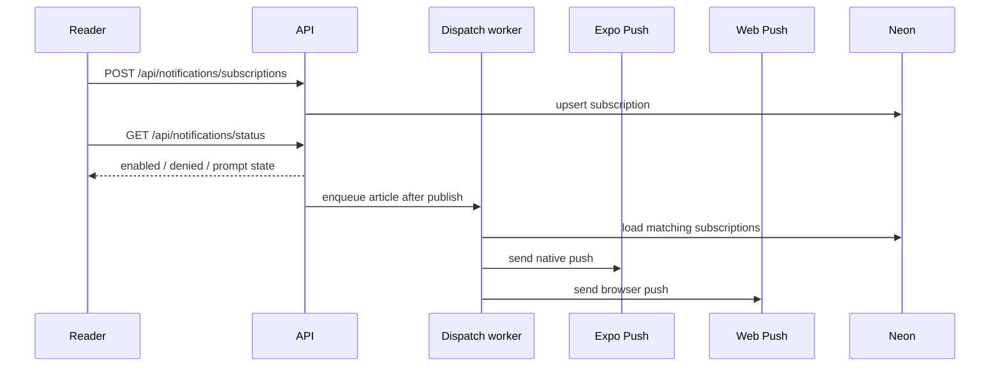

# Notifications

> **Living doc** — update in the same change when push subscription, delivery, or prompt behavior changes.  
> **Last verified against:** 2026-09-01 (popup-only opt-in, resilient web subscription registration, and native channel setup)

## Purpose

Opt-in push notifications across the Expo reader, web/PWA, and API-backed dispatch pipeline. The goal is to let readers subscribe to city-local news alerts without account sign-in while keeping permission prompts respectful and infrequent.

## Boundaries

- **In scope:** Subscription registration, permission-state tracking, prompt backoff, article-to-subscriber dispatch, Expo push, Web Push, service-worker delivery.
- **Out of scope:** Per-user accounts, social sharing of notifications, algorithmic ranking beyond city/category/language matching.

## Context diagram

## Components / key types

| Name | Role |
|------|------|
| `notification_subscriptions` | Anonymous device/browser subscription rows keyed by client id + platform |
| `NotificationSubscription` | EF entity with city, platform, delivery mode, token/subscription details, and prompt timestamps |
| `NotificationDispatchQueue` | Background queue for article publish events |
| `NotificationDispatchWorker` | Hosted service that drains the queue |
| `NotificationDispatchService` | Looks up matching subscriptions and sends push payloads |
| `NotificationsEndpoints` | Public status/upsert/delete endpoints for the reader |
| `src/storage/notificationPreferences.ts` | Client-side client id + prompt backoff state |
| `src/notifications/registerNotifications.ts` | Platform-specific permission and subscription registration |
| `src/components/NotificationOptInBanner.tsx` | Feed surface opt-in prompt |

## Data & control flows

## Key files

- `apps/api/Data/Entities/NotificationSubscription.cs`
- `apps/api/Endpoints/NotificationsEndpoints.cs`
- `apps/api/Services/NotificationDispatchQueue.cs`
- `apps/api/Services/NotificationDispatchService.cs`
- `apps/api/Services/NotificationDispatchWorker.cs`
- `apps/app/src/components/NotificationOptInBanner.tsx`
- `apps/app/src/notifications/registerNotifications.ts`
- `apps/app/public/sw.js`

## Public contracts

| Surface | Contract |
|---------|----------|
| `GET /api/notifications/status` | Returns current permission and subscription state for a client id + platform |
| `POST /api/notifications/subscriptions` | Upserts an anonymous subscription/device registration |
| `DELETE /api/notifications/subscriptions/{clientId}?platform=...` | Disables a subscription |
| `Notifications__ExpoAccessToken` | Expo push service token |
| `Notifications__ExpoPushApiUrl` | Expo push API URL |
| `Notifications__WebPushSubject` | VAPID subject / contact |
| `Notifications__WebPushPublicKey` | Browser push public key |
| `Notifications__WebPushPrivateKey` | Browser push private key |
| `EXPO_PUBLIC_WEB_PUSH_PUBLIC_KEY` | Reader-side browser push public key |

## Failure modes & invariants

- Permission prompts are throttled locally; a dismissal should not cause repeated nagging on every open.
- A browser or device-level denial stays visible as an actionable error in the popup and does not create a permanent inline prompt.
- Web Push requires HTTPS, a service worker, and a valid VAPID keypair.
- Existing browser subscriptions are recreated when their application server key no longer matches the configured VAPID public key.
- Push send failures must not block article ingest or editorial publish flows.
- Anonymous subscriptions are device/browser scoped and can be removed without an account.

## Related docs

- [00-system-overview](./00-system-overview.md)
- [02-api](./02-api.md)
- [03-data-model](./03-data-model.md)
- [06-reader-app](./06-reader-app.md)
- [07-shared-types](./07-shared-types.md)
- [08-hosting-and-ci](./08-hosting-and-ci.md)
- [PRD](../PRD.md)

## Change checklist

| When you change… | Update… |
|------------------|---------|
| Subscription schema / prompt logic | This page + [03-data-model](./03-data-model.md) |
| Endpoints / API transport | This page + [02-api](./02-api.md) + `packages/shared-types` |
| Reader prompt UX | This page + [06-reader-app](./06-reader-app.md) |
| Push env / web push setup | This page + [08-hosting-and-ci](./08-hosting-and-ci.md) |
