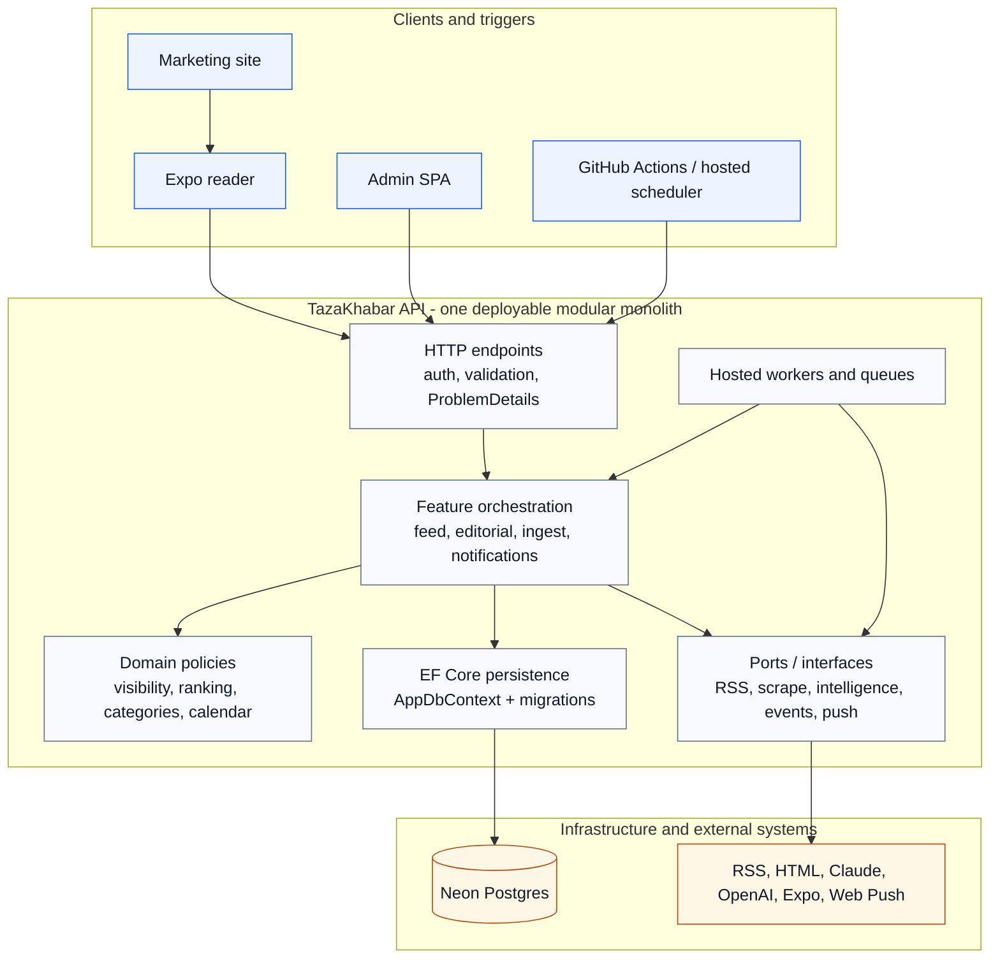
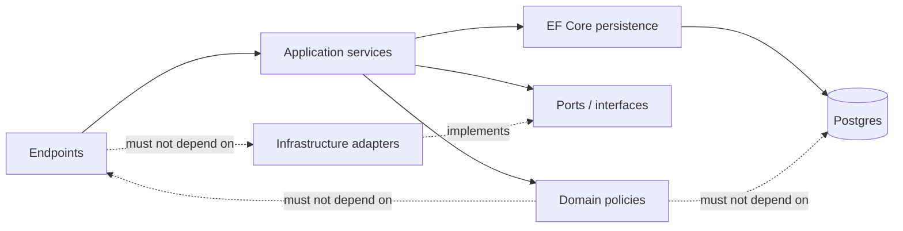
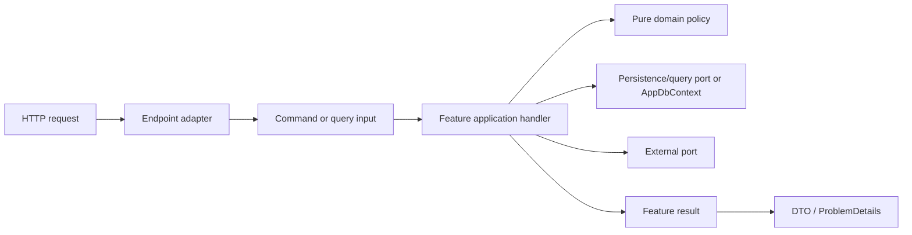
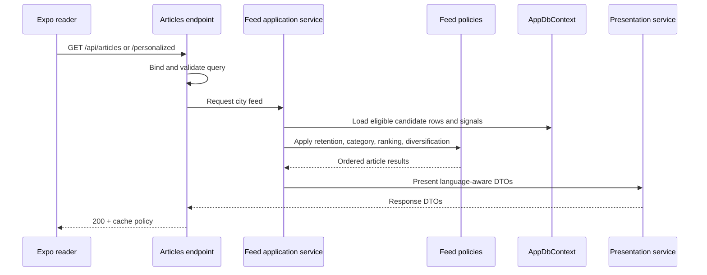
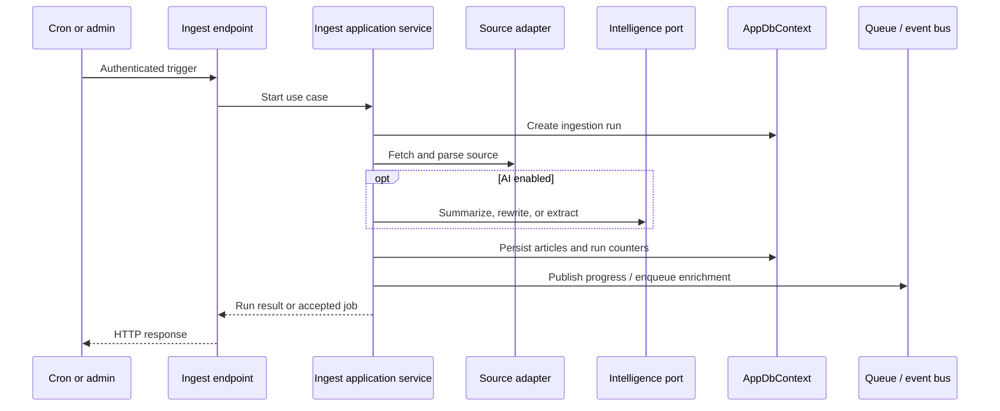
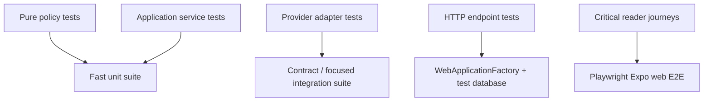

# Design principles and quality model

> **Living doc** - update when service boundaries, dependency direction, or architectural guardrails change.  
> **Last verified against:** 2026-09-08 (local working tree)

## Purpose

This page defines how TazaKhabar should evolve while remaining a small, understandable modular monolith. It makes the system's dependency direction explicit, records the current SOLID assessment, and gives contributors practical rules for deciding when code belongs in an endpoint, application service, domain policy, or infrastructure adapter.

This is a design guide, not a mandate to introduce layers for their own sake. The existing API stays as one deployable process and EF Core remains the data-access technology owned by the API.

## System shape

The system has three user-facing surfaces plus scheduled triggers, all crossing one API-owned data boundary. Clients and schedulers communicate through HTTP; the API owns authentication, validation, orchestration, persistence, and the public contract.

### Dependency direction

The desired direction is inward: transport code depends on application contracts; application code depends on policies and ports; infrastructure implements ports. A small feature may combine these concerns in one file while it is young, but the dependencies should not point back toward HTTP or provider details.

The current code is partway along this direction: provider integrations use interfaces, and the public article endpoints now delegate read-side persistence rules to `IArticleFeedQueryService`, response mapping to `IArticleResponseMapper`, and translation caching to `IArticleTranslationStore`. Other endpoint groups still depend directly on `AppDbContext`, which remains acceptable for simple CRUD but is the next boundary to improve when behavior becomes more complex or needs broader testing.

## SOLID assessment

| Principle | Current assessment | Evidence and next standard |
|-----------|--------------------|----------------------------|
| Single Responsibility | Improving, still partial | Public article handlers now delegate query and mapping responsibilities, and presentation no longer owns translation persistence. Several admin and ingest handlers still combine validation, persistence, and orchestration. Keep handlers as transport adapters and move reusable behavior into focused application services or policies. |
| Open/Closed | Good in integrations, partial in business rules | `IArticleIntelligence`, `IArticleRewriter`, `IRssFeedClient`, and related ports make provider replacement straightforward. Category/status branching is still hard-coded in several flows; use named policies or strategies when variants grow. |
| Liskov Substitution | Good | Provider implementations are registered behind small interfaces and can be replaced in tests. Keep interfaces behavioral and avoid implementations that require callers to know provider-specific rules. |
| Interface Segregation | Good | Existing interfaces are narrow and feature-specific. Do not create broad `INewsService` or `IRepository` interfaces that force unrelated consumers to depend on methods they do not use. |
| Dependency Inversion | Improving, still partial | `Program.cs` is a clear composition root, external systems are abstracted, and the public read path now uses feature query, mapping, and translation-store ports. Direct `AppDbContext` usage remains in simpler endpoint groups; introduce use-case-level ports only where they reduce coupling or enable meaningful isolated tests. |

Overall: the architecture is a sound modular monolith with good seams around external providers, but it is not yet a strict layered or textbook SOLID implementation. The goal is progressive separation driven by complexity, not ceremony.

## Feature structure

For a new feature, use this flow:

### Responsibilities

| Area | Owns | Must avoid |
|------|------|------------|
| Endpoint | Binding, authentication context, HTTP status codes, headers, OpenAPI metadata | Business rules, provider calls, large EF query graphs |
| Application service / handler | Use-case orchestration and transaction boundaries | HTTP-specific types and provider-specific payloads |
| Domain policy | Deterministic rules such as visibility, ranking, category classification, and date windows | Database, network, logging, or framework dependencies |
| Persistence | EF queries, entity configuration, migrations | HTTP response shaping and external provider behavior |
| External adapter | Calling and translating one provider behind a port | Deciding product policy or mutating unrelated aggregates |
| Worker | Queue claim, retry/lifecycle handling, scoped service execution | Duplicating use-case rules already owned by application services |

## Runtime flows

The following flows show the target responsibility split for new or refactored use cases. Today, some endpoint handlers perform parts of the application-service work inline; the refactoring roadmap below describes how to move that logic safely.

### Reader feed request

### Ingestion request

## Guardrails for implementation

1. Keep `Program.cs` as the composition root. New implementations are wired there; business code should not construct providers or read environment variables directly.
2. Keep endpoints thin enough that the use case can be tested without constructing an HTTP request. They may use `AppDbContext` directly for simple CRUD until the logic becomes reusable, branching, or difficult to test.
3. Keep deterministic rules pure where practical. `ContentCategoryClassifier`, `ArticleVisibility`, `ArticleRetention`, and calendar calculations are good candidates for unit tests without a database.
4. Put provider-specific behavior behind a narrow interface. Provider failures should be translated into application outcomes, not leak SDK or raw HTTP details into endpoint code.
5. Return DTOs from API boundaries. Do not expose EF entities to clients or let client DTO concerns leak into persistence code.
6. Keep one reason to change per service. If a class changes because both ranking rules and translation storage changed, split those responsibilities before adding more behavior.
7. Prefer composition over inheritance. Use a strategy or policy only when there are genuinely interchangeable behaviors, not to hide a single `if` statement.
8. Preserve the API-only database boundary and regenerate OpenAPI/shared-types for contract changes.
9. Do not introduce repositories, MediatR, a domain-event framework, or separate deployable services by default. Add them only when a measured problem justifies the extra indirection.

## Refactoring roadmap

This is the recommended order when improving design quality:

| Stage | Change | Success signal |
|-------|--------|----------------|
| 1 | Extract shared request validation and pagination models from the largest endpoint handlers | Endpoint files mostly bind inputs and delegate; validation behavior has focused tests |
| 2 | Extract feed query/ranking orchestration from `ArticlesEndpoints` into a feature service | Feed behavior can be tested through a service contract and policy tests; read-side query and response mapping are now extracted |
| 3 | Split `ArticlePresentationService` into translation lookup, provider translation, and DTO mapping responsibilities | DTO mapping and translation persistence are now isolated; provider orchestration remains in the presentation use case |
| 4 | Introduce persistence ports only around use cases that need isolated tests or alternate storage/query behavior | Ports represent use cases, not every EF table |
| 5 | Add architecture tests or static checks for forbidden dependencies | New code cannot accidentally make clients query the database or domain policies depend on HTTP |

## Testing model

Test behavior and outputs rather than mock call counts. The most valuable first tests are category/ranking/visibility policy tests, followed by endpoint tests for authorization, validation, pagination, and ProblemDetails responses.

## Architecture review checklist

Before merging a structural change, confirm:

- The dependency direction still points inward.
- Each new service has one clear responsibility and a small public surface.
- External providers are behind interfaces when replacement or failure isolation matters.
- Endpoint code remains transport-focused.
- API, OpenAPI, shared-types, and consuming clients changed together for contract updates.
- Relevant atlas pages have an updated `Last verified against` date.
- The change adds tests at the lowest practical level: policy, service, endpoint, then E2E.

## Related docs

- [00-system-overview](./00-system-overview.md)
- [02-api](./02-api.md)
- [03-data-model](./03-data-model.md)
- [04-ingestion](./04-ingestion.md)
- [07-shared-types](./07-shared-types.md)
- [PRD](../PRD.md)
- [ADR-001 monorepo](../adr/001-monorepo.md)

## Change checklist

| When you change... | Update... |
|--------------------|----------|
| Dependency direction or design guardrails | This page + `.codex/rules/architecture-docs.mdc` if the mapping changes |
| Endpoint/application boundaries | This page + [02-api](./02-api.md) |
| Ingestion orchestration or provider ports | This page + [04-ingestion](./04-ingestion.md) |
| Data ownership or persistence boundary | This page + [00-system-overview](./00-system-overview.md) + [03-data-model](./03-data-model.md) |
