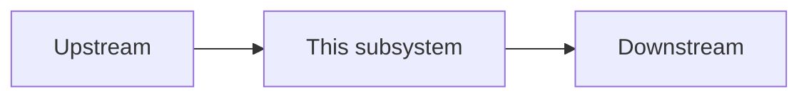
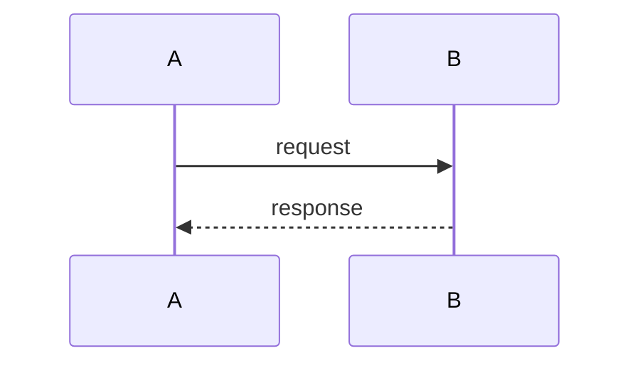

# [Subsystem name]

> **Living doc** — update in the same change when this subsystem’s behavior or boundaries move.  
> **Last verified against:** YYYY-MM-DD (commit/branch or “local working tree”)

## Purpose

One paragraph: what this subsystem is for.

## Boundaries

- **In scope:** …
- **Out of scope:** …

## Context diagram

## Components / key types

| Name | Role |
|------|------|
| … | … |

## Data & control flows

## Key files

- `path/to/file`

## Public contracts

Endpoints, events, env vars, OpenAPI operation names — as applicable.

## Failure modes & invariants

- …

## Related docs

- ADR-…
- `docs/PRD.md`
- Specs/plans if any

## Change checklist

When you change … → update …
