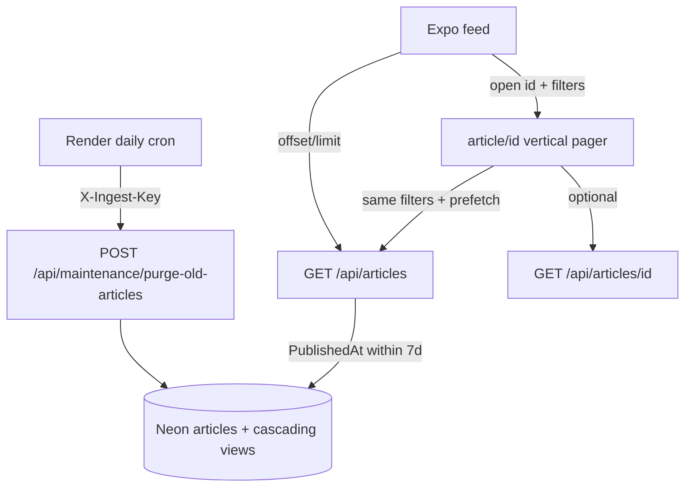

# Latest-news retention, feed pagination polish & immersive swipe reader

**Date:** 2026-08-14  
**Status:** Approved for planning  
**Product:** NewsFeed (placeholder name)

## Problem

Readers should only see fresh local news. Old rows accumulate with no retention policy. The feed already paginates via `offset`/`limit` infinite scroll but needs clearer loading/end states. Opening an article is a single static detail screen — not a continuous, Inshorts-style vertical reading flow.

## Goals

1. **Hard-delete** articles older than 7 days so the store stays “latest only.”
2. **Public APIs** never return content older than 7 days (even if purge cron lags).
3. **Harden feed infinite scroll** (loading footer, end-of-feed, safe stop conditions) — no page-number UI.
4. Replace article open with a **full-screen immersive dark vertical pager** of summary cards; swipe up = next, down = previous.
5. Show a **coach overlay** until the user successfully swipes once (persisted on device).
6. Keep WhatsApp share + bookmark on each card; stay within light product shell for the feed (dark immersion is reader-only).

## Non-goals

- Soft-delete / archive-for-admin retention (explicitly rejected — hard delete).
- Numbered page controls on the feed.
- Horizontal Stories-style swipe.
- Scraped full-body in-card reading (see related spec `2026-08-14-full-article-reader-design.md` — orthogonal; this swipe stack uses **headline + summary** digests).
- Visible “Next” button (vertical gesture only for this slice).
- Reader auth or personalized ranking.

## Decisions (from brainstorm)

| Topic | Choice |
|-------|--------|
| Scope | All three: retention + infinite-scroll polish + swipe reader |
| Old news | Hard delete from DB |
| Retention window | 7 days (`ArticleRetention__Days`, default 7) |
| Card content | Inshorts-style summary cards (not full publisher body) |
| Gesture | Vertical swipe only |
| Feed pagination UX | Keep infinite scroll; polish states |
| Coach | Show until first successful swipe, then AsyncStorage flag |
| Visual | Immersive dark full-screen cards (aesthetic A) |
| Approach | Render cron purge + filter on public reads + evolve `article/[id]` into vertical pager |

## Architecture

## 1. Retention (hard delete)

### Eligibility

- Delete rows where the retention timestamp is older than `now - ArticleRetention__Days`.
- Use `PublishedAt` when the article was ever published; otherwise `CreatedAt` (covers draft/pending/rejected that never published).
- Apply across statuses so the DB does not become a long-lived editorial archive.

### Endpoint

- `POST /api/maintenance/purge-old-articles`
- Auth: existing ingest secret header `X-Ingest-Key` (same as RSS/scrape crons).
- Behavior: delete in batches (e.g. 500) until none remain; return `{ deleted: number }`.
- Idempotent; log deleted count (no article payloads/secrets).

### Cron

- Add daily cron in `render.yaml` hitting the purge endpoint with the ingest key.

### Public read filter (belt-and-suspenders)

- `GET /api/articles`, trending, and `GET /api/articles/{id}` only expose articles with `PublishedAt >= utcNow - retentionDays`.
- Older id → **404**.

### Config

- `ArticleRetention__Days` (int, default `7`).

## 2. Feed pagination polish

- Keep API `offset` / `limit` (default 20, max 50).
- Feed UX:
  - Footer **“Loading more…”** while appending.
  - **“You’re caught up”** when `offset >= total` or last page returned fewer than `limit` items.
  - Pull-to-refresh resets offset to 0.
  - Append failure keeps prior items and offers retry (no wipe).

## 3. Immersive vertical swipe reader

### Route

- Evolve `apps/app/app/article/[id].tsx` into a full-screen vertical pager (not a separate `/stories` mode).

### Visual (reader-only)

- Dark canvas; edge-to-edge image with bottom gradient; white/light headline over image; digest body; source · relative time; Share + bookmark; position `n / total`; back control.
- Soft persistent “↑ Next story” cue after coach dismissed.
- Moti / RN Animated for page transitions; keep tap targets large.

### Stack / data

- Opening from feed passes city (+ category / date / lang when set) so the pager uses the **same ordered list** as the feed.
- Start index = tapped article; load neighbors via `getArticles` with same filters; prefetch next page near end of loaded stack.
- Cold / deep link: load by id; rebuild stack from stored city preference + any query params; if id missing/purged → 404 UI + back to feed.
- Record view for the visible card (existing view endpoint) when the page settles.

### Coach

- Dim overlay + sheet: “Swipe up for the next story” / shown until first successful page change.
- Persist dismissed state in AsyncStorage after that swipe.
- Storage failure → may show again (acceptable).

### End of stack

- Calm end card: “You’re caught up” — no empty infinite swipes.

## Error handling

| Case | Behavior |
|------|----------|
| Purge without key | 401 |
| Cron lag | Public filter still hides >7d |
| Purged / unknown id | 404 article screen |
| Prefetch fail | Stay on current card; soft retry later |
| Empty feed | Do not open empty pager |
| Append fail on feed | Keep list; retry footer |

## Testing

- **API:** purge removes only eligible old rows; cascades views; public list excludes >7d; by-id old → 404; unauthorized purge → 401.
- **App:** end-of-feed state; coach dismisses after simulated swipe; pager advances across mocked pages; 404 path for missing id.

## Docs (same implementation PR)

- `docs/architecture/02-api.md` — purge + retention filter
- `docs/architecture/03-data-model.md` — retention policy note
- `docs/architecture/06-reader-app.md` — swipe reader + coach
- `docs/architecture/08-hosting-and-ci.md` — daily purge cron
- Bump **Last verified against** on each edited page

## Relationship to full-article-reader

`2026-08-14-full-article-reader-design.md` adds scraped `body` and removes source redirects. This spec’s swipe cards use **summaries**. If both ship, the pager chrome stays; card body copy can later prefer `body` when present without changing gesture/retention/pagination decisions here.

## Implementation sketch (for planning)

1. Retention options + purge endpoint + tests + Render cron + public 7-day filter.
2. Feed infinite-scroll UX polish + tests.
3. Vertical pager + immersive dark cards + coach storage + prefetch + tests.
4. Atlas updates + OpenAPI/shared-types only if response DTOs change (purge response).
